# ECC608 AES Message Encryption

This application example demonstrates AES encryption being run on Host MCU or MPU while having
the master symmetric key held securely in ECC608 secure element.

## Description

- The master symmetric key is stored in ECC608 and a derived key is generated using KDF command. The parameters used to calculate the derived key are then shared to the Cloud/
remote host so it can calculate the same derived key to perform AES operations.
- Storing the symmetric key in ECC608 ensures that the master key is never exposed.
- The derived key can also be set to expire (ephemeral key) after a set time frame in the software.
- Once the current key expires, the remote host and MCU/MPU system can agree on parameters
and generate a fresh ephemeral key.

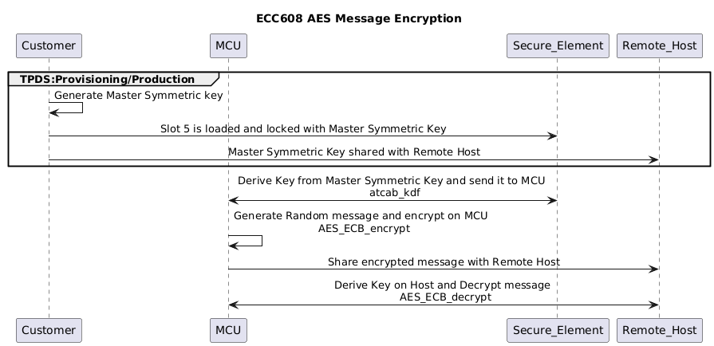

## Training Video

# ATECC608 AES Message Encryption Execution

## Prerequisites

- [Trust Platform Design Suite](https://www.microchip.com/en-us/products/security/trust-platform/tpds)
- [MPLAB® X IDE](https://www.microchip.com/en-us/tools-resources/develop/mplab-x-ide#tabs)
- [Cryptoauth Trust Platform Development Kit](https://www.microchip.com/developmenttools/productdetails/DM320118)

## Setting up [Cryptoauth Trust Platform Development Kit](https://www.microchip.com/developmenttools/productdetails/DM320118)

- Ensure both the ON and CTS switches are in the ON position in the Dual SPST DIP Switch.

    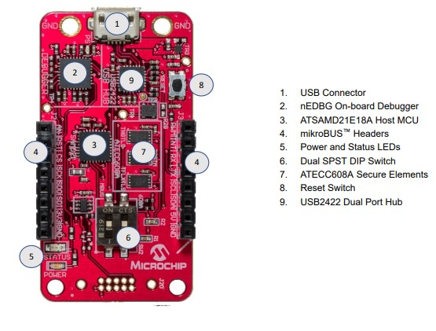

- Connect the micro USB port on the board to the computer using a micro USB cable.

## Opening the ECC608 AES Message Encryption Use Case

- Open [Trust Platform Design Suite](https://www.microchip.com/en-us/products/security/trust-platform/tpds) and navigate to Usecases Section.

- In the Use Case dropdown,search for "AES Message Encryption" and select "AES Message encryption" under the ATECC608-TFLXTLS group.

    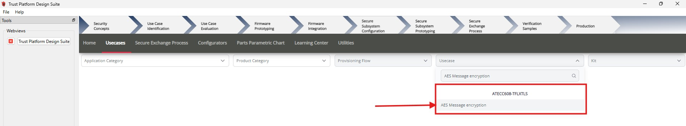

- The ECC608 AES Message Encryption use case will open.

    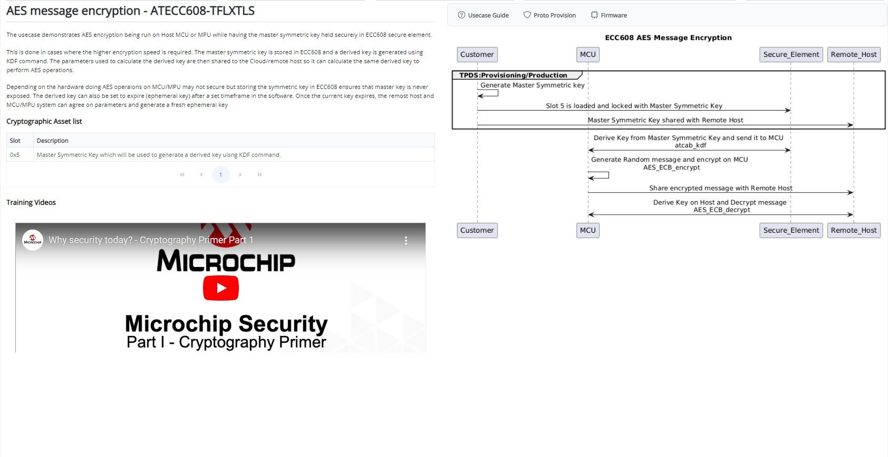

## Provisionig Usecases Resources

- From the Kit Dropdown, select the Cryptoauth Trust Platform Kit.

    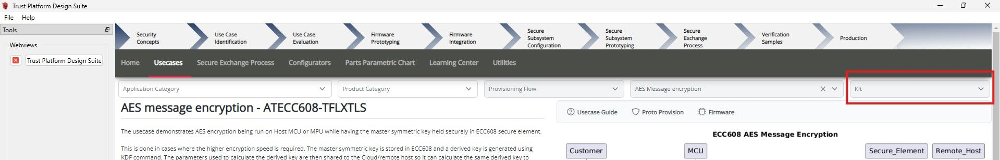

- Click on Proto Provision.

    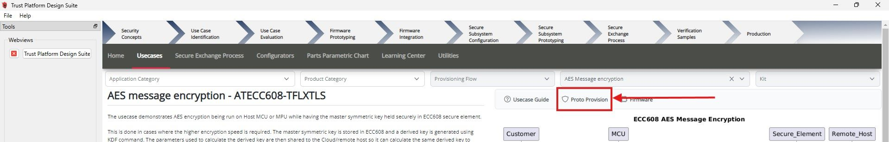

- Select the Generate option to create and use a new Symmetric Key, or upload a user-specific Symmetric Key for  Mater Symmetric Key.
- Click on Proto Provision

    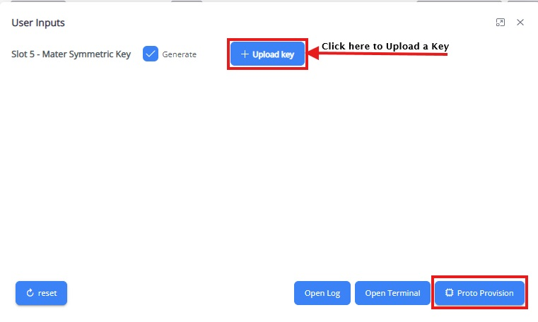

- The necessary resources will be created at  `~/.trustplatform/aes_message_encryption`:
    - **slot_5_secret_key.h**: This file contains a 32-byte Master symmetric key, which is loaded into Slot 5, and it will be utilized to perform kdf operation to derive key in the Firmware project. 
    - **slot_5_secret_key.pem**: This file contains the generated symmetric key in PEM format.
    - **slot_6_secret_key.h**: This file contains the IO Protection key which is loaded into Slot 6.
    - **slot_6_secret_key.pem**: This file contains the IO Protection key which is loaded into Slot 6 in PEM format.
- Click on Yes in the pop-up to load resources onto ECC608.
- **Proto Provision Success Toast** will pop up after successfully loading resources, **Proto Provision Success** will be logged onto the terminal.

    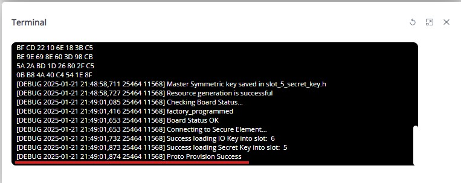

## Build and Program Application
- Once the resources have been successfully loaded, open the Firmware Project by clicking on the Firmware button.

    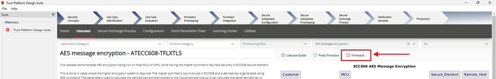

- The project **aes_msg_enc_ecc608** will open in the MPLABX IDE.
- Right-click on **aes_msg_enc_ecc608** and select "Set as Main Project".

    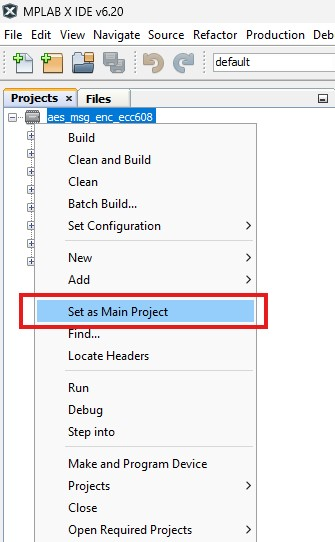

- Click on "Make and Program Device".

    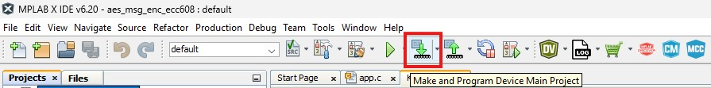

- After the programming process is complete, launch the Terminal application (e.g., Tera Term) on your computer.
- Connect to the Virtual COM port and configure the serial settings as follows:
    - Baud : 115200
    - Data : 8 Bits
    - Parity : None
    - Stop : 1 Bit
    - Flow Control : None
- Press the Reset button on Cryptoauth Trust Platform Development Kit
- Review the output message in the console:

   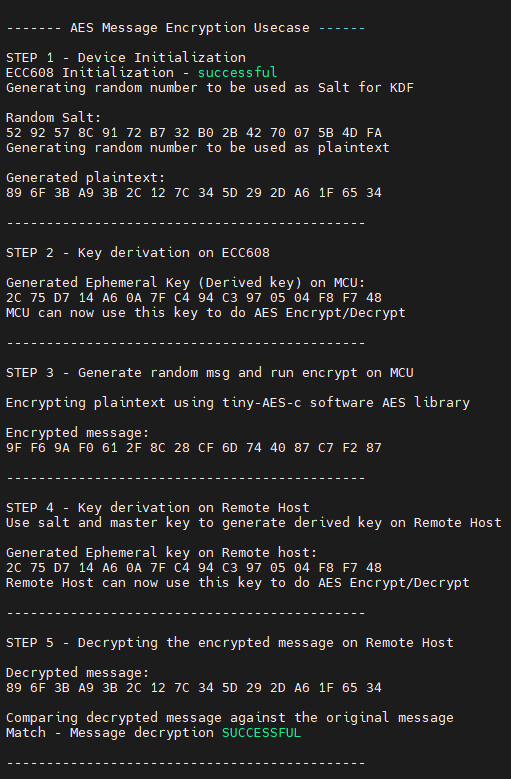

- Console displays a message stating the decrypted message matches the original message.

## Conclusion

The ECC608 AES Message Encryption use case demonstrates a secure method for encrypting messages by storing the master symmetric key within the ECC608 secure element. This ensures the key is never exposed, enhancing security. The guide provides detailed steps for setting up the hardware and software, provisioning resources, and programming the application. Successful execution and verification confirm the system's effectiveness in securely handling AES encryption. This use case highlights the importance of secure key storage and management in cryptographic operations.
