# TA010 Asymmetric Authentication

Asymmetric Authentication in computer security involves two entities exchanging information to verify each other's identity.
This process aims to prevent cloning and counterfeiting, ensuring that an object is genuine and authorized to connect to a product.
This example demonstrates the use of asymmetric authentication with the Microchip TA010-TFLXAUTH device for accessory or disposable authentication.
It details how the Microchip TA010-TFLXAUTH device can be used for asymmetric authentication through device certificates and ECC key pairs.

## Description

- Implements a comprehensive asymmetric (public/private) key cryptographic signature solution based on Elliptic Curve Cryptography (ECC) and the ECDSA signature protocol.
- **Verify Certificate Chain:**
    - The Host requests the Signer Certificate and verifies the certificate with the Authority Public key(Root).
    - Upon successful verification, the Host requests the Device Certificate and verifies it using the Signer Certificate.
- **Challenge-Response:**
    - The Host generates a random number challenge and sends it to the TA010-TFLXAUTH.
    - The TA010-TFLXAUTH signs the random number challenge with the Device Private Key.
    - The signed challenge is returned to the Host for verification using the Device Public Key, thereby completing the Chain of Trust verification.
    - In this usecase, ATECC608 is used for Certificate chain verification and signature verification on Host side. 

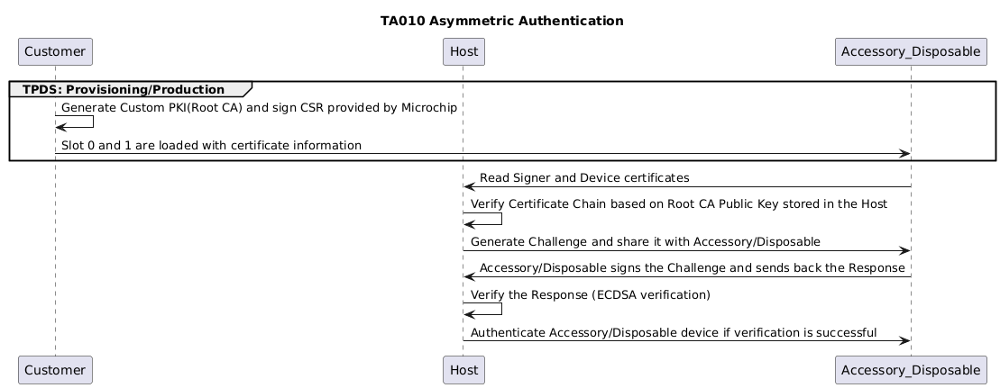

## Training Video

# TA010 Asymmetric Authentication

## Prerequisites

- [TPDS(Trust Platform Design Suite)](https://www.microchip.com/en-us/products/security/trust-platform/tpds)
- [MPLAB® X IDE](https://www.microchip.com/en-us/tools-resources/develop/mplab-x-ide#tabs)
- [Cryptoauth Trust Platform Development Kit](https://www.microchip.com/developmenttools/productdetails/DM320118)
- [EV74C12A - TA010 mikroBUS Evaluation Board](https://www.microchip.com/en-us/development-tool/EV74C12A)

## Setting up Cryptoauth Trust Platform Development Kit (DM320118)

- Ensure both the ON switch and CTS switch on the DM320118 Kit is in the ON position. Refer to label 6 in the figure below.

    

- Insert the EV74C12A Socket Board into the mikroBUS header of the Cryptoauth Trust Platform Development Kit.

- Connect the micro USB port on the board to the computer using a micro USB cable. You should notice Power LEDs light up on both the Trust Platform board as well as the EV74C12A Socket board.

## Setting up for Usecase
- Make sure the MPLABX path is set in File -> Preferences -> MPLABX path.

    

- Make sure the DM320118 board is factory programmed. Navigate to the Utilities Tab, select **DM320118** and press **Factory Program**. This step ensures the MCU is programmed with the default firmware needed to provision the TA010 in the next steps. Without the default firmware, the next steps will not work.

- After factory programming process is complete, launch the Terminal application (e.g., Tera Term) on your computer.

- Connect to the Virtual COM port and configure the serial settings as follows:
    - Baud : 115200
    - Data : 8 Bits
    - Parity : None
    - Stop : 1 Bit
    - Flow Control : None

- Press the Reset button on the Cryptoauth Trust Platform Development Kit and observe a similar log:

    

## Opening the TA010 Asymmetric Authentication Usecase

- Open TPDS and navigate to Usecases Section.
- Select Usecase as `Asymmetric Authentication` under TA010-TFLXAUTH and the kit as `CryptoAuth Trust Platform`

    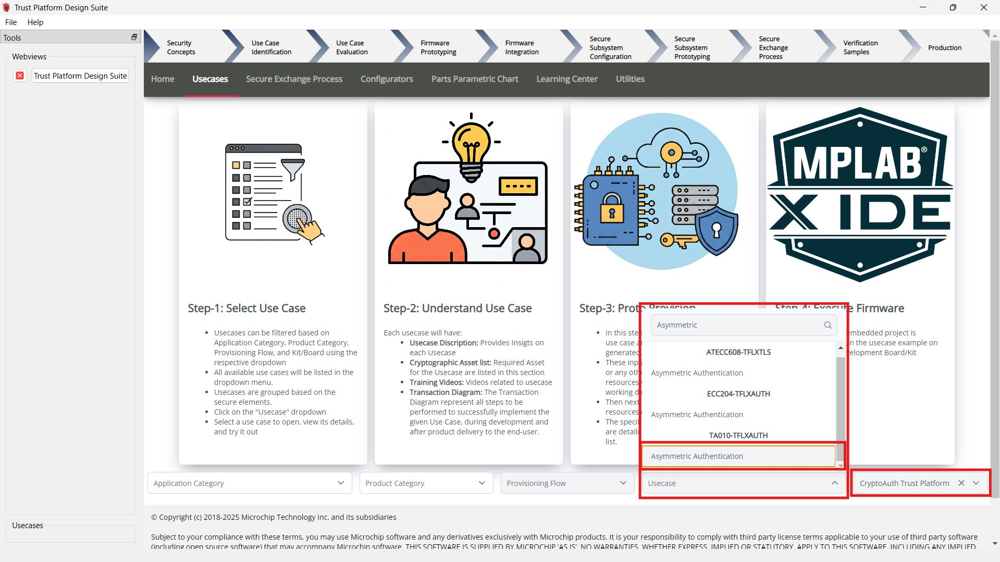

- The `TA010-TFLXAUTH - Asymmetric Authentication` usecase will open as below:

    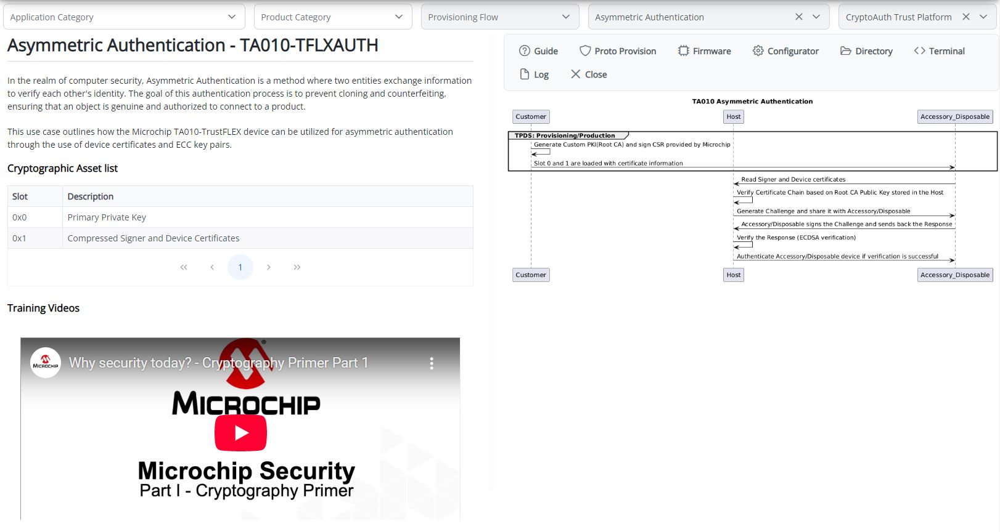

## Provisioning Blank TA010 Device
To configure a blank TA010 device into TA010-TFLXAUTH device for the usecases, follow these steps:

### Open TA010-TFLXAUTH Configurator

Click on the "Configurator" button within the use case to launch the TA010-TFLXAUTH Configurator.

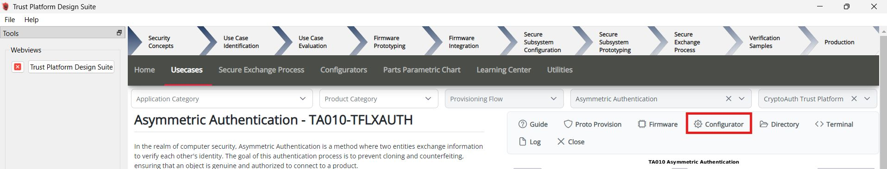

##### Adjust the Configuration

Once the TA010-TFLXAUTH Configurator is open:

- Leave the Device address empty to configure with the default TFLXAUTH address. **The use case requires the device to be configured with the default TFLXAUTH address.**
- Select the I2C or SWI interface in the configurator based on the interface of the device.
- Select Limited key use.

    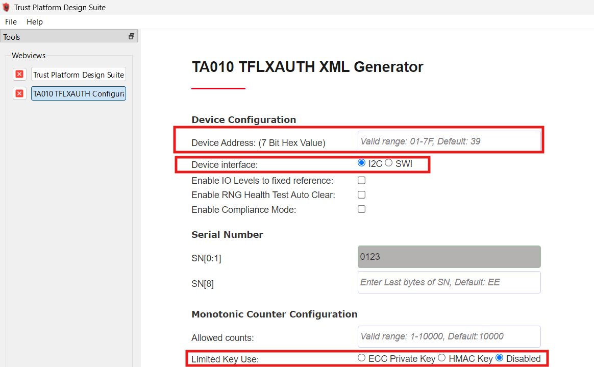

##### Proto Provisioning

- After adjusting configuration, scroll down and click on **Provision Prototype Samples**.

    

- Wait for the provisioning process to complete. The following result is observe:

    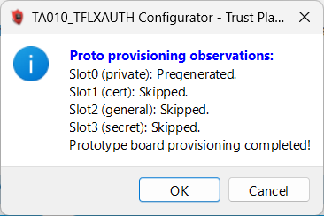

- Click on **OK** to close the success dialog.

- After provisioning, power cycle the device by disconnecting and reconnecting the USB cable.

## Provisioning Usecase Resources

This step provisions the device for the specified use case. It gathers the necessary resources, generates the firmware resources, and provisions the device accordingly.

- Double-check that you selected the right target development kit.

    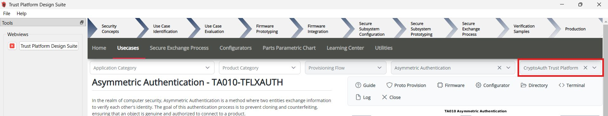

- Click on Proto Provision

    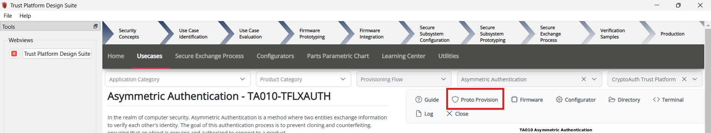

- Select the User Options:
    - Choose the Device Interface, the same interface selected in the configurator.
    - To Generate Certificates:
        - Select the **Generate** option within the **Certificates** section.
        - Enter the Organization Name for generating certificates in the **Organization Name** text box.
        - Enter the Validity in years for the Root Certificate in the **Root Certificate** text box.
        - Enter the Validity in years for the Signer Certificate in the **Signer Certificate** text box.
        - Enter the Validity in years for the Device Certificates in the **Device Certificate** text box.
        - Validity can range from 0 to 127 years; entering 0 will set the certificate expiration date to the year 9999, indicating it will not expire.
        - Choose the Generate option to create new private keys or upload user-specific keys for the Root and Signer private keys.

            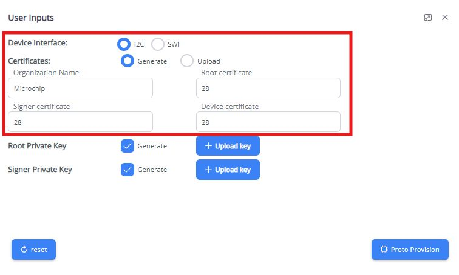

    - To Upload and reuse certificates:
        - Select the **Upload** option within the **Certificates** section.
        - Upload the Root Certificate in the **Root Certificate** field.
        - Upload the Signer Certificate in the **Signer Certificate** field.
        - Upload the Signer Private Key in the **Device Certificate** field.
            - The Device Certificate will be tailored to the specific device, using the device serial number and public key for generation.
            - The Signer Private Key is necessary for generating and signing the Device Certificate.
        - The **Root Private Key** and **Signer Private Key** fields are unused in this case.

            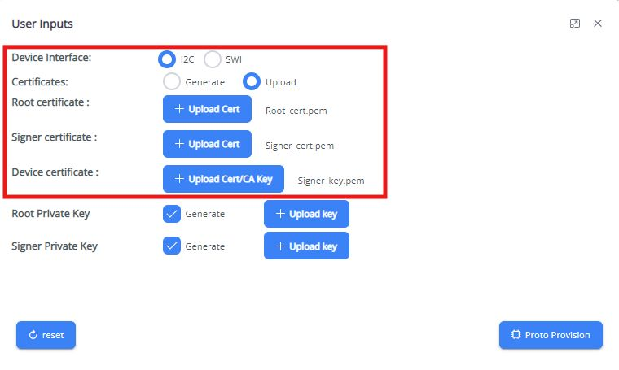

    - Click on Proto Provision

- The necessary resources will be created in the usecase working directory `~/.trustplatform/symm_auth_ta010`:
    - **project_config.h** : Includes the selected interface for communication with the TA010 device.
    - **cust_def_device.c**: Contains the Generated Device Certificates Template and compressed certificate defination in C. A dummy public key will generated and used during resource generation. While Provisioning Device, Public key will replaced by reading the device public key.
    - **cust_def_signer.c**: Contains the Generated Signer Certificates Template and compressed certificate defination in C.
    - **Root_cert.pem**: Contains Generated/Uploaded Root certificate in PEM format.
    - **Signer_cert.pem**: Contains Generated/Uploaded Signer certificate in PEM format.
    - **Device_cert.pem**: Contains Generated Device certificate in PEM format.
    - **Root_key.pem**: Contains Generated/Uploaded Root Private Key.
    - **Signer_key.pem**: Contains Generated/Uploaded Signer Private Key.
    - **Device_pub_key_SN.pem**: Contains Device Public Key Read from device.

- To open the use case working directory containing the use case resources Click on the `Directory` button .

    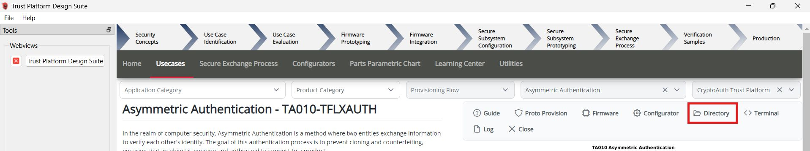

- Click Yes in the pop-up to load resources into TA010. A confirmation pop-up will appear once the loading process is complete.

## Build and Program Application
-  Make sure the MPLABX path is set in File -> Preferences -> MPLABX path.

    

- Once the resources have been successfully loaded, open the Firmware Project by clicking on the Firmware button.

    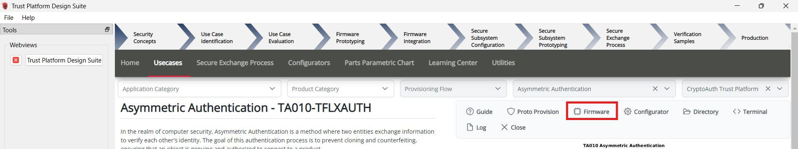

- The project **asymm_auth_ta010** will open in the MPLABX IDE.
- Right-click on **asymm_auth_ta010** and select "Set as Main Project".

    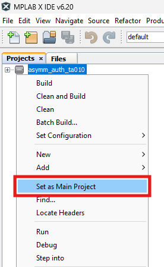

- Click on "Make and Program Device".

    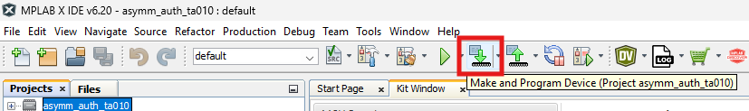

- Once the programming process is complete, please launch the Terminal application (e.g., Tera Term) on your computer if it has not been set up initially.

    - Connect to the Virtual COM port and configure the serial settings as follows:
        - Baud : 115200
        - Data : 8 Bits
        - Parity : None
        - Stop : 1 Bit
        - Flow Control : None

- Press the Reset button on Cryptoauth Trust Platform Development Kit

- The console will display a message indicating that the asymmetric authentication was successful.

- Review the output message in the console:

   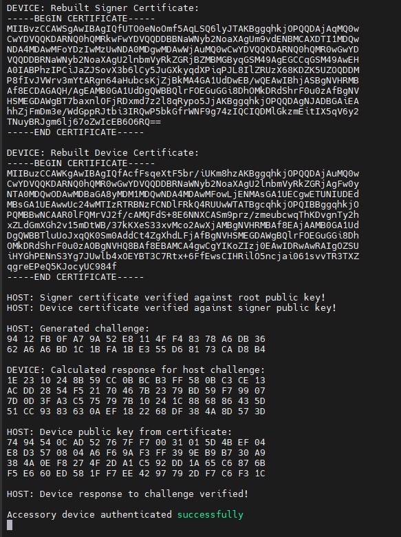

## Conclusion

The outlined use case demonstrates the configuration of the TA010-TFLXAUTH device for asymmetric authentication, utilizing ECC and ECDSA algorithms to ensure secure accessory or disposable authentication. This comprehensive guide covers the setup of the Cryptoauth Trust Platform Development Kit, the provisioning of a blank TA010 device, and the generation of necessary cryptographic resources. It concludes with the steps to build and program the firmware, ultimately verifying the successful implementation of asymmetric authentication through the TA010-TFLXAUTH secure element.