# Firmware Over-The-Air Update with keySTREAM-ECC608-TMNGTLS

## Description

Firmware Over The Air (FoTA) is a critical technology that enables remote updates of embedded device firmware without the need for physical access. This capability is essential for maintaining device security, deploying new features, and fixing bugs in a scalable and efficient manner. keySTREAM Connect is a secure, cloud-based platform designed to streamline and manage the FoTA process across a wide range of IoT devices.

Implementing FoTA with keySTREAM Connect and ECC608-TMNGTLS not only reduces operational costs and minimizes downtime but also enhances the overall reliability and security of connected devices. This use case demonstrates how organizations can efficiently manage large-scale device fleets and deliver continuous improvements to their products in the field.

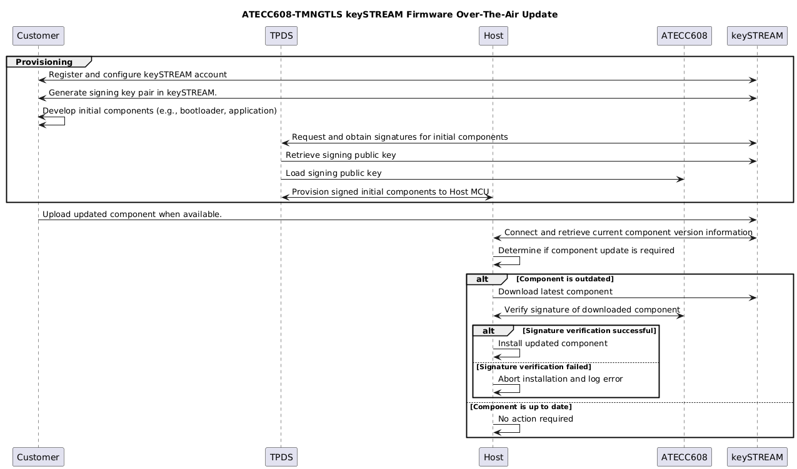

## Training Video

## Prerequisites

- Software
    - [Trust Platform Design Suite (TPDS)](https://www.microchip.com/en-us/products/security/trust-platform/tpds)
    - [MPLAB® X IDE](https://www.microchip.com/en-us/tools-resources/develop/mplab-x-ide#tabs)
    - Serial monitor program ("e.g. TeraTerm")
- Hardware
    - [CryptoAuth Pro Trust Platform Development Kit (EV89U05A)](https://www.microchip.com/developmenttools/productdetails/EV89U05A)
    - [WIFI WINCS02: EV68G27A](https://www.microchip.com/en-us/development-tool/ev68g27a)
        - Firmware version needs be 3.0.0 or higher
        - [Device Firmware Update (DFU) guide](https://onlinedocs.microchip.com/oxy/GUID-B7A95EBE-7BB2-4AF4-A525-700FB718E47A-en-US-3/GUID-346DCACA-9907-4FCC-A018-B2BBA0C98FDC.html)
    - Micro USB cable

## Setup

- Connect WINCS02 on MicroBus2 (MB2) connector as shown below

    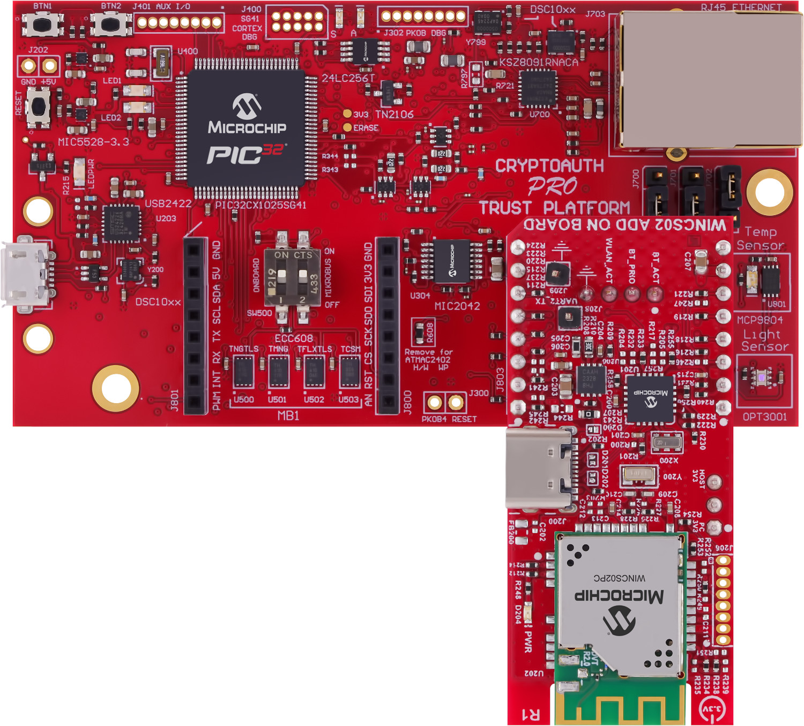

- Ensure both the ON and CTS switches are in the ON position in the Dual SPST DIP Switch (**SW500**) for selecting onboard *ECC608 TRUSTMANAGER* device. *The I2C device address of *ECC608 TRUSTMANAGER* device is 0x70*
- Connect the micro USB port on the board to the computer using a micro USB cable.
- Make sure the MPLAB X path is set in File -> Preferences -> MPLAB X path on TPDS.

    

- Instructions for loading Factory program the CryptoAuth Pro Trust Platform kit (EV89U05A)
    - Go to the TPDS "Utilities", click on "Device Interactions", select the EV89U05A board.

    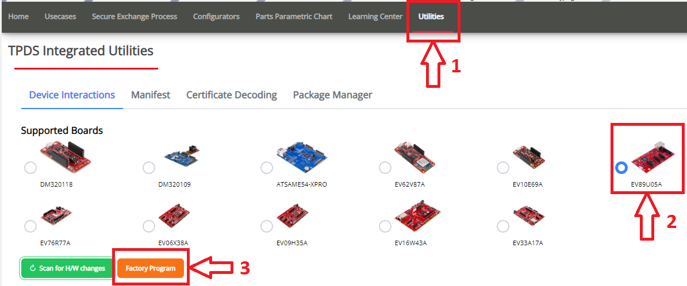

    - click ***Factory program*** and wait until the process in completed, you will see a message when it is done

    

- After factory programming process is complete, launch the Terminal application (e.g., TeraTerm) on your computer.
- Connect to the Virtual COM port and configure the serial settings as follows:
    - Baud : 115200
    - Data : 8 Bits
    - Parity : None
    - Stop : 1 Bit
    - Flow Control : None

- Press the Reset button on the CryptoAuth Pro Trust Platform Development Kit and observe a similar log:

    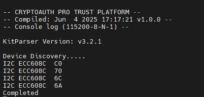

## keySTREAM Account Setup and Requirements

- Step 1: Creating a Kudelski keySTREAM account
    - You must create an account on the Kudelski keySTREAM portal to proceed with the use case. Registration is free.
    - Go to the following link for account creation: [Register link](https://mc.obp.iot.kudelski.com)
    - Click on register.

        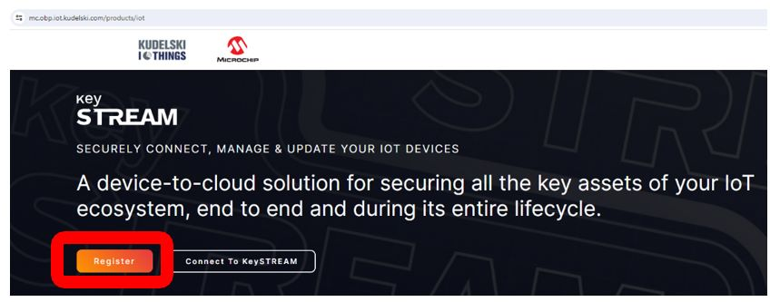

    - Provide the information required for account creation. A verification email will be sent to the provided email address.

        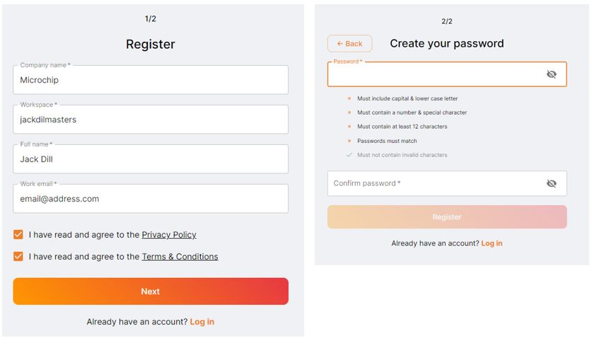

    - Look for the verification code in the registered email. Enter the verification code once it is available to you. Once the correct code is entered, you should see a successful account creation message.
    - **WARNING**: No two accounts can have the same workspace similarly to email addresses. No two different user can create the same email addresses.

        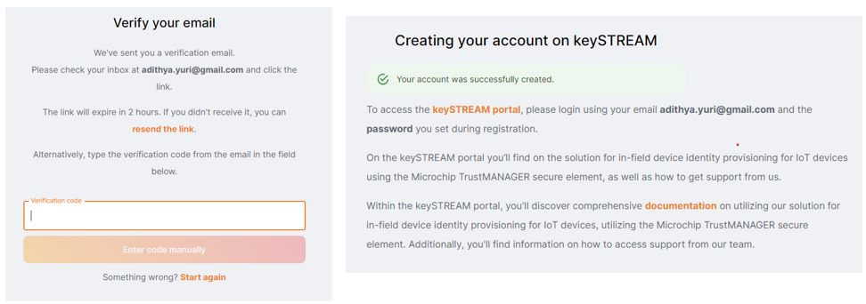

    - **SUPPORT**: If you experience issues creating the account contact: iot.ops@nagra.com

- Step 2: Creating a [fleet profile](#creating-a-fleet-profile) under the keySTREAM portal.
    - In this step, we will create a fleet profile under the Kudelski keySTREAM portal. A fleet profile could represent a product line or a subdivision under a product line. For example, you can set up a fleet profile for a line of internet-connected thermostats; this will let you remotely manage those specific devices. During the creation of the fleet profile, we will provide information required for creating a Root CA that will be used for this specific set of devices. All the devices under the fleet profile will be signed by this Root CA certificate. Each created fleet profile will always have a Root CA certificate associated with it.
    - Log in to the Kudelski keySTREAM portal.

        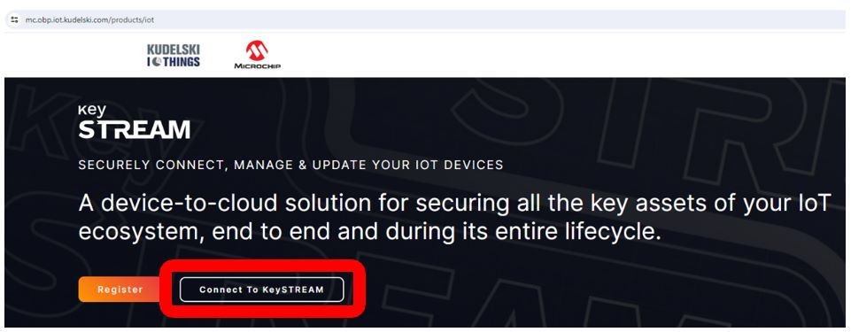

    - Upon completing the registration process, you will gain access to your own tenant on the keySTREAM SaaS platform from Kudelski IoT.

### Signing in on keySTREAM portal

- To sign in to the keySTREAM portal, please locate the link provided in the email from the **Kudelski IoT Onboarding Portal** confirming the creation of your keySTREAM tenant. This email includes comprehensive instructions, so ensure you review it carefully.

- Alternatively, go back to the keySTREAM portal via this link and click [Login to keySTREAM](https://mc.obp.iot.kudelski.com). Once logged in, you will be redirected to the home page.

    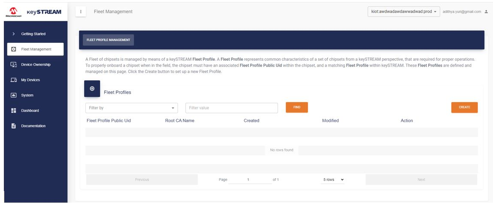

- For the upcoming steps, it's essential to be signed in to the keySTREAM portal.

### Creating a Fleet Profile

- A Fleet profile:
    - Is a label attached to a fleet of devices sharing the same configuration
    - Serves as a link between you, the device manufacturer, and the devices you will have in the field.
    - Will be referenced both on keySTREAM and in your device firmware.
    - Is identified by a **Fleet Profile Public UID** that is easily readable by a human, as further explained below.
    - the first 4-digits of the Fleet provide will be part of the ECC608 ordering part number.

- The keySTREAM portal allows you to create a Fleet Profile and attach a configuration to it:

- Click on Fleet & PKI from the left panel as shown in the figure below.

    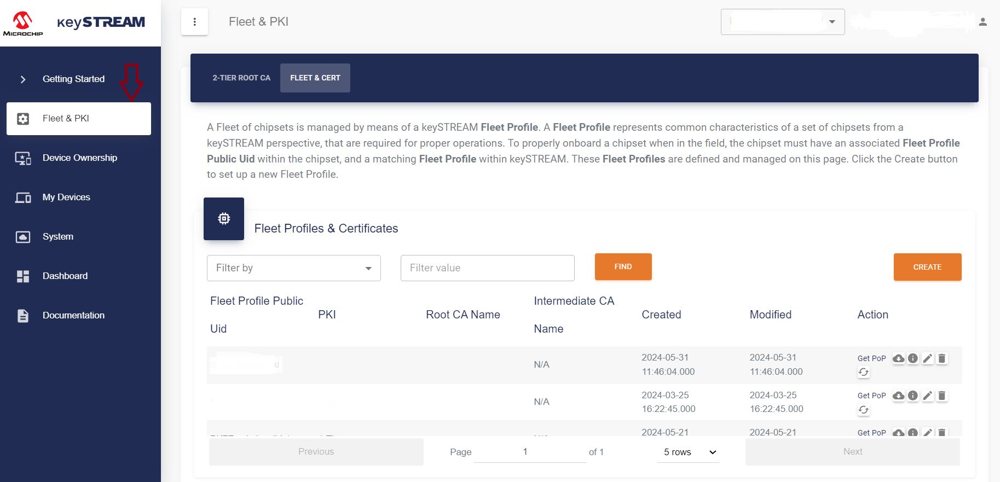

- Click on **FLEET & CERT** and **CREATE**  as shown in figure below.

    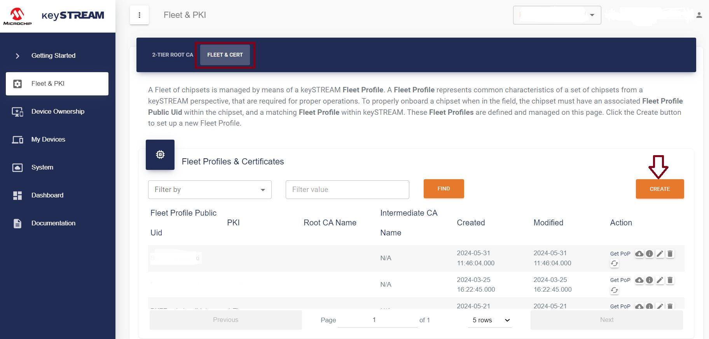

- A popup window appears:

    

    -  The following fields can be configured:

        - **Fleet Profile Public Uid (required):**
            A unique URI string identifying the Fleet Profile. It is advised to avoid creating two Fleet Profiles with the same name. The final Fleet Profile Public UID will be a concatenation of an auto-generated prefix (e.g., 9S4F:) and the Fleet Profile Public UID (example.org:dp:network:device) that you have defined. The final Fleet Profile Public UID would look like 9S4F:example.org:dp:network:device.

        - **Model, Brand and Manufacturer:** These are optional and purely informational, for your own use.

    - Upon clicking on **NEXT**, you can create your own 1-tier Root Certificate Authority (CA) associated with this new Fleet Profile:

    

    - This is the step where you create your customized 1-tier Root Certificate Authority secured by Kudelski HSMs. The following fields will have to be configured:
        - **Root CA Common Name (CN):**  This field is restricted to a fixed length of 16 bytes. If your input is shorter, it will be right-padded with spaces; a longer input will be truncated.

        - **Root CA Organization (O):** This field is restricted to a fixed length of 16 bytes. If your input is shorter, it will be right-padded with spaces; a longer input will be truncated. Note that the Organization Unit will be hardcoded to TrustMANAGER.

        - **Root CA Certificate Validity(Years):** Number of years of validity for the Root CA.

        - **Device Operational Certificate validity (Years):** The number of years of validity for the Device Operational Certificate. It must be shorter than the Root CA Certificate validity.

    - After you click on **COMMIT**, a newly configured Fleet Profile with its freshly created custom Root CA appears in the list below:

        

    - All devices that are configured with this Fleet Profile will be provisioned with a unique device certificate signed by the certificate authority (CA) associated with this Fleet Profile when they register on keySTREAM.

- **Creating a 2-Tier Fleet Profile with a keySTREAM generated rootCA**

    Some companies security policies requires the root CA to be separated from the device certificate. That's where the Intermediate Certificate Authority (ICA) brings its meaning. Here the rootCA, ICA, are generated and protected within Kudelski HSMs.

    - If you need to create a 2-Tier Fleet Profile, follow the steps below:

    - Root CA of your 2-Tier PKI: You can have only one 2-Tier Root CA, which will sign as many 2-Tier Intermediate CAs as needed.

    - Click on **Fleet & PKI** from the left panel, then select **2-TIER ROOT CA**, and finally click on **OK** as shown in the figure below.

        

    - A popup window appears :

        

    - After creating a ROOT CA, a pop-up will appear indicating that it has been successfully created, as shown below.

        

    - Click on **FLEET & CERT** and  **CREATE**, as shown in figure below.

        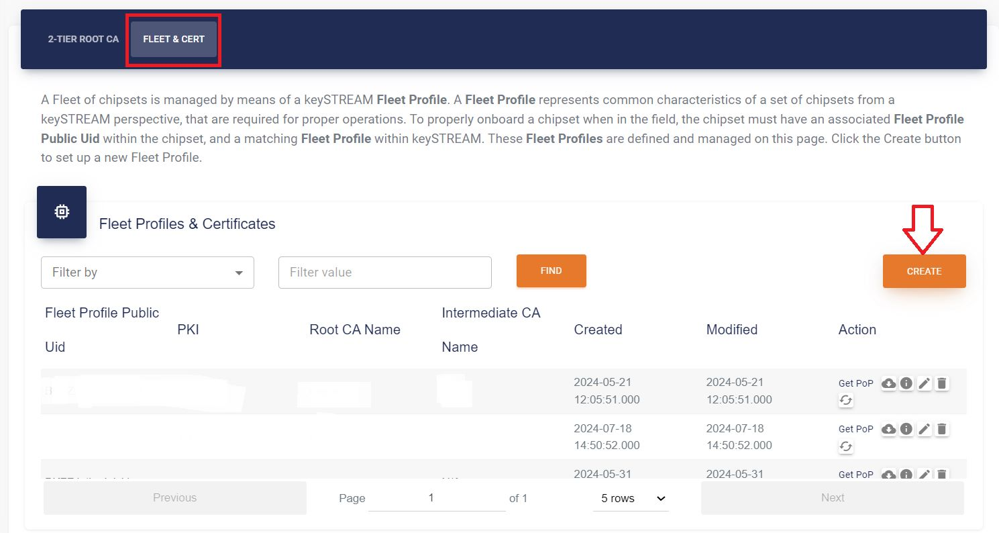

    - A popup window appears :

        

    - Upon clicking on **NEXT**, you can create your own Root Certificate Authority (CA) associated with this new Fleet Profile:

        

    - After you click on **COMMIT**, a newly configured 2-Tier Fleet Profile with its freshly created custom Root CA appears in the list below:

        

 **Creating a 2-Tier Fleet Profile with your own rootCA**

Some companies security policies requires the root CA to be separated from the device certificate. That's where the Intermediate Certificate Authority (ICA) brings its meaning. Here you are given the option to bring your own rootCA instead or using the keySTREAM generated rootCA

- If you need to create a 2-Tier Fleet Profile, follow the steps below:

    - Under "Fleet & PKI" in the "import your Bring-your-own RootCA for 2-tier PKI" click on the "Import" button

        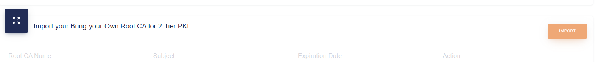

    - Choose the .pem or .der file containing your rootCA

        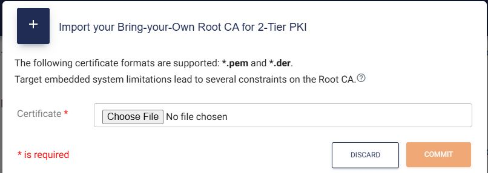

    - [WARNING] Root CA of your 2-Tier PKI: You can have only one 2-Tier Root CA, which will sign as many 2-Tier Intermediate CAs as needed.
    - Click on **Fleet & PKI** from the left panel, then select **2-TIER ROOT CA**, and finally click on **OK** as shown in the figure below.

        

    - Click on **FLEET & CERT** and  **CREATE**, as shown in figure below.

        

    - A popup window appears :

        

    - Upon clicking on **NEXT**, you can create your own Root Certificate Authority (CA) associated with this new Fleet Profile:
    - select the external rootCA previously imported

        

    - After you click on **COMMIT**, a newly configured 2-Tier Fleet Profile with its freshly created custom Root CA appears in the list below:

        

### Obtaining an API key

- From the keySTREAM portal, you can generate an API key to be used in the TPDS UI. This key enables the TPDS backend to connect to your user account, access the signing key for its public key, and sign user components. Follow these steps to obtain your API key:

    - On the left panel, click on **System**, then on the tab **API KEYS**.
     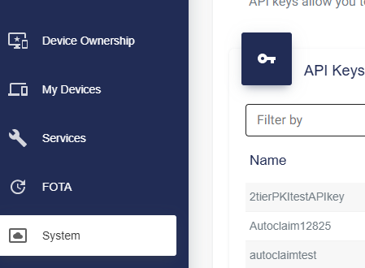

    - On the right hand side, click on **CREATE**.
    - The Create API Key popup window appears :

        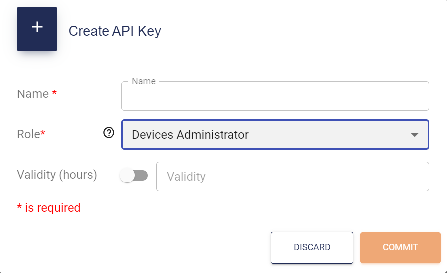

    - The Name field can be freely chosen.
    - The Role to be selected here is **Devices Administrator** (aka **dmAdmin**)
    - The Validity can be specified in hours or left empty, in which case the API key will never expire.
    - Click **Commit** to create the API key, which will appear in the list of API keys.

- Locate the API key that you just created, in the list, and on the Action column, click the pencil icon (tooltip: **Edit**):

    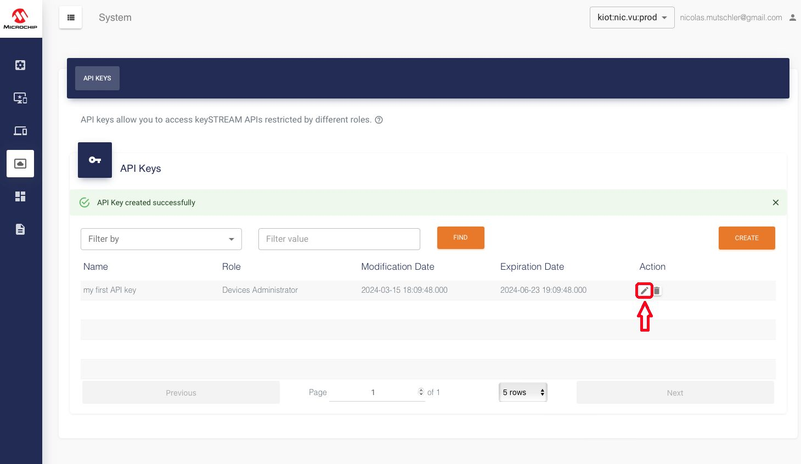

- A popup window appears, **Edit Api Key**:

    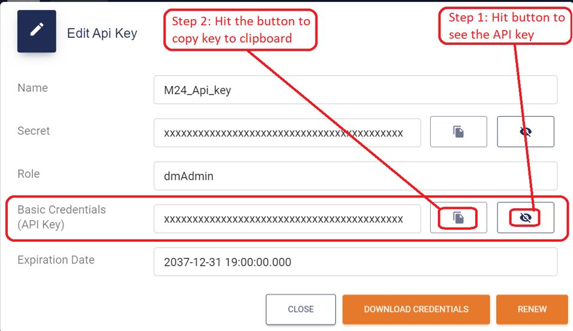

The API key that is expected in this use case is the value in the field "Authorization Token". Unmask it by clicking on the eye button on the right, then copy/paste it somewhere for later use. You can also click the **DOWNLOAD CREDENTIALS** button; the downloaded file contains the same "BasicCredentials" field, among other metadata.

### Creating Signing Key Pairs

- Through the keySTREAM portal, you can generate or upload your own asymmetric keys, such as those used for signing firmware. The signing private key is securely protected within the keySTREAM HSM. This key will be used to retrieve the corresponding public key for verification purposes and to sign user components.
- On the left panel, click on **Services**, then on the right-hand side, click on **CREATE**.

    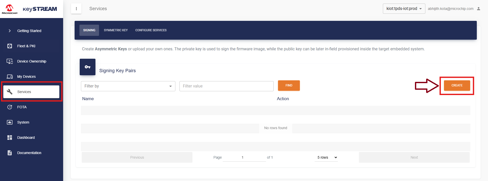

- A popup window appears:
    - Select `You ask keySTREAM to generate the entire Key Pair. You provide its name. You will have to sign with the keySTREAM sign API`.

    - Enter the Name for the Key and click on **COMMIT**

        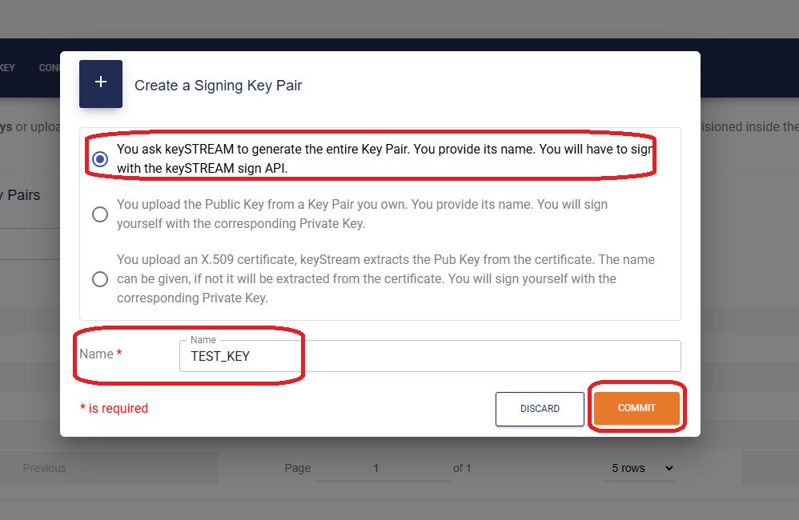

    - keySTREAM will create an asymmetric key pair for signing operations, and this key can be used with the keySTREAM Sign REST API to sign your data.

        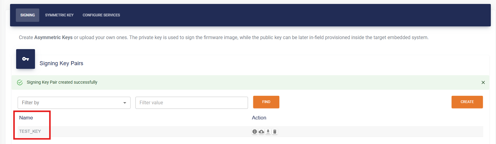

    - Alternatively keySTREAM gives you the options to either upload your own public key or upload an entire X509 certificate containing the public key corresponding to the private you took the responsibility to generate securely in your own environment

        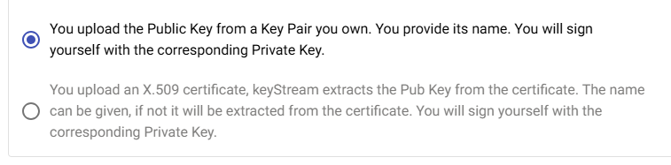

At this point in time of the setup, all your cryptographic assets needed to start the FOTA use case are ready.

## Opening the ATECC608-keySTREAM Firmware Over-The-Air Update Usecase

- Open TPDS and navigate to the Use Cases section.
- Select the kit as `CryptoAuth Pro Trust Platform`
- Select Usecase as `keySTREAM Firmware Over-The-Air Update` under ECC608-TMNGTLS

    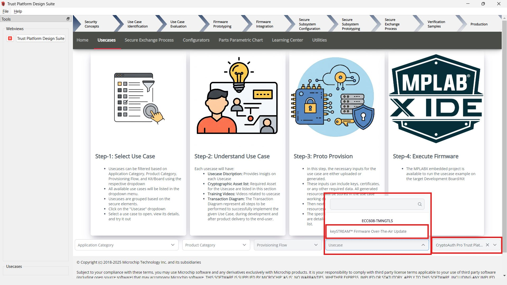

- The `keySTREAM™ Firmware Over-The-Air Update` Usecase will open as below:

    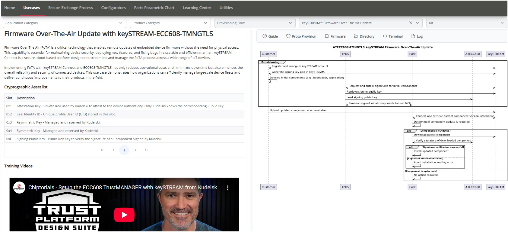

### Generating device manifest

Device manifest is a file that describes a specific device(s). It contains public information about the device. This file is used in this Usecase for device claiming (Process through which you claim the device into your account).

- Device claiming is a one time operation. For specific device this step needs to be done only once, there is no need to redo this step for running the Usecase again. Though there are methods to change ownership of the device, we recommend claiming device on one keySTREAM account and using it on the same account.

- Factory program the CryptoAuth Pro Trust Platform kit (EV89U05A). This step loads firmware so TPDS can talk to the device.

    - Go to the TPDS "Utilities", click on "Device Interactions", select the EV89U05A board.

    

    - Click ***Factory program*** and wait until the process in completed, you will see a message when it is done

    

- Now go to "Utilities", click on "Manifest" and follow the instructions below

    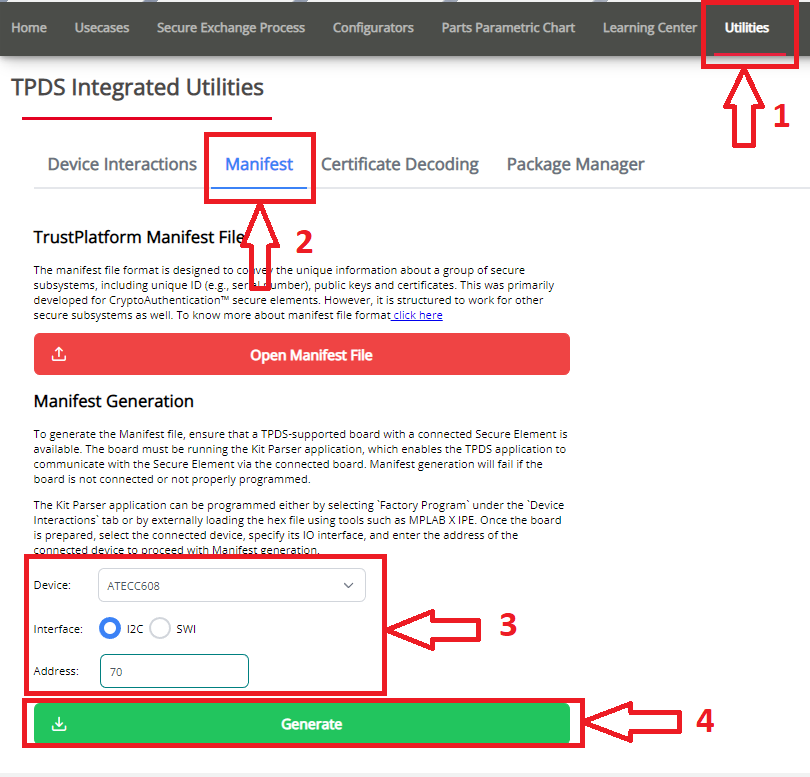

- Select **ATECC608** as **Device**, **I2C** as **Interface**, **70** as **Address** and click on **Generate**

- Once manifest is generated, there will be a pop-up message with the generated manifest file location

    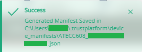

- Navigate to `~/.trustplatform/device_manifest` and observe the created files. There is the JSON file with your device UID and other metadata. This is the file which we can use to upload to TPDS to obtain our device UID, also known as serial number.

    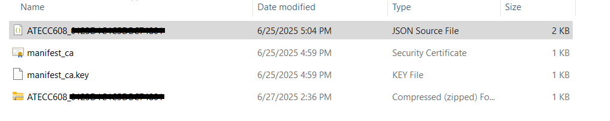

- Open your TPDS tab, go to "Utilities" on the horizontal pane and then "Manifest"

    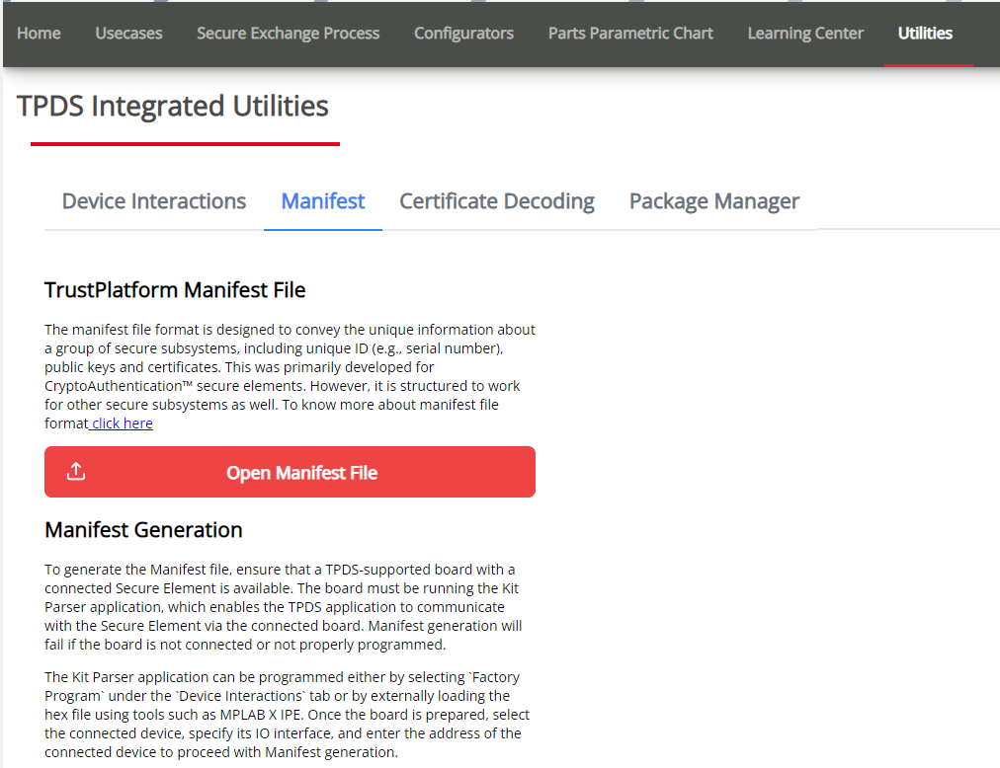

- Select "Open Manifest File" and then in the window, navigate to `~/.trustplatform/device_manifest` directory and select your JSON file that TPDS generated for you.

- Select that file and you will see a window pop up asking you to upload a custom Manifest Signer Certificate, select Yes.

    

- Select the "manifest_ca" certificate file and then you will see it display a new tab in TPDS showing the device UID and other metadata

    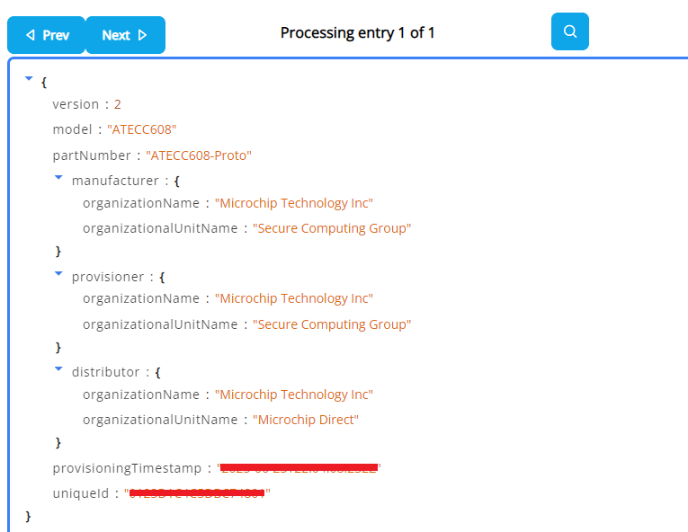

- Note the uniqueId field in your previously mentioned text document as we will need this in the next step when we provide it to keySTREAM.

- Navigate to your keySTREAM tab and switch to the "Device Ownership" tab and then "Device Claiming". You may paste your Chip Unique ID into the field and then hit the "Commit" button.

    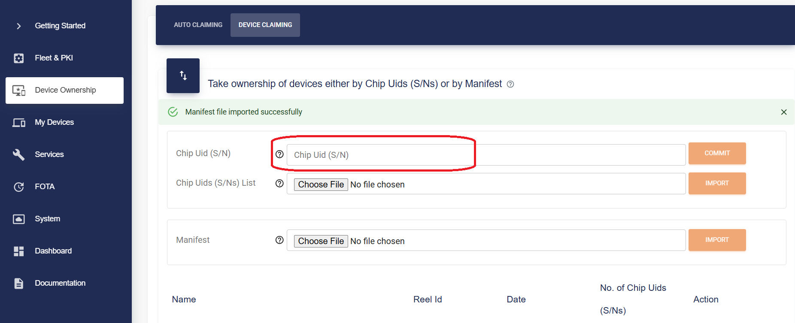

This completes the Device Claiming process on keySTREAM.

### Provisioning Usecase Resources

This step prepares the embedded system by gathering the necessary resources, generates the firmware resources, and provisions the device accordingly.

- Double-check that you selected the right target development kit.

    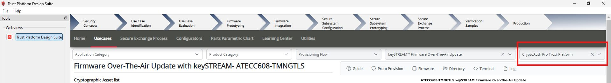

- Click on Proto Provision

    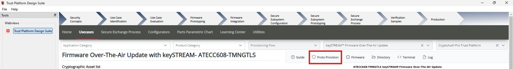

- Provide user Inputs:

Make sure there is **no space** before or after each character strings

- **Fleet Profile Public UID** - Enter the Fleet Profile Public UID Created in keySTREAM at [Creating a Fleet Profile](#creating-a-fleet-profile)
- **Authorization Token** (API Key) - Provide keySTREAM Authorization Token which you have copied in [Obtaining an API key](#obtaining-an-api-key), refer this section for more details.
- **Signing Key Name** - Provide name of the Signing Key from keySTREAM created at [Creating Signing Key Pairs](#creating-signing-key-pairs), refer this section for more details.
- **WiFi SSID** - Provide WiFi SSID to which device needs to connect
- **WiFi Password** - Provide Wifi Password for device to connect

     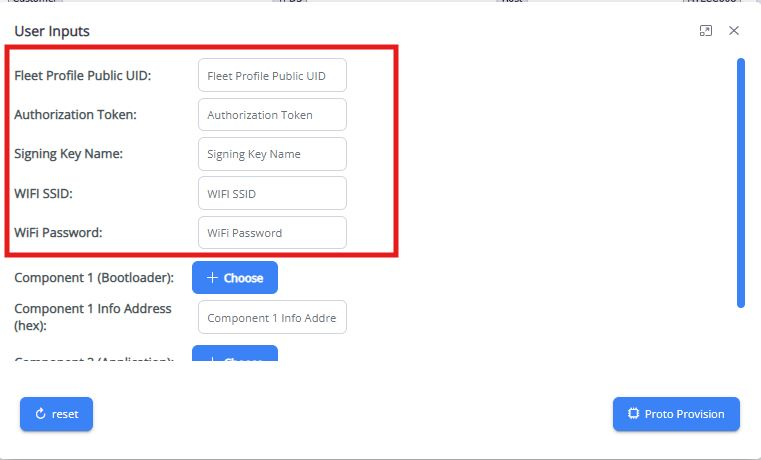

- Click on Proto Provision, this will generate the resources for firmware project.
- Click **No** in the pop-up asking to load generated resources into Secure Element. At this step we are only generating the resources to build the component binaries.

    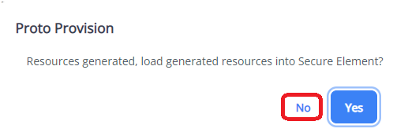

- The necessary resources will be created in the Usecase working directory `~/.trustplatform/keystream_fota`:
    - **component_aabbccdd.hex/bin**: Processed Component along with its signature in  hex and bin file format. aabbccdd in the file_name is Image type and versions fetched from the Component meta data. Refer to Component meta data in the firmware for more details.
    - **combined_component.hex/bin**: If both components are provided, they will be merged to generate this combined binary.
    - **KEY_NAME.pem**: Signing Public Key retrieved from keySTREAM.

- To open the use case working directory containing the use case resources click on the `Directory` button.

    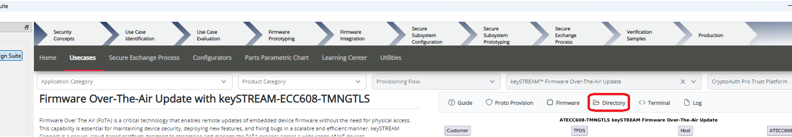

- Now open the firmware project by clicking on the `Firmware` button.

    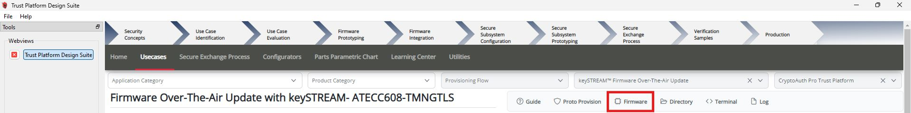

- MPLAB will open and will have the two open projects
    - `sg41_sboot` - This is the bootloader firmware project
    - `KTA_FOTA` - This is the application firmware project
    - Build both the projects by right click on project and hit `Clean and Build` button to have the HEX images to be signed ready

    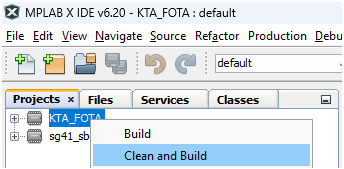

- Click again on `Proto Provision` to create signed components from the generated binaries

    

- Provide user Inputs:
    - Leave Fleet Profile Public UID, Authorization Token, Signing Key Name, WiFi SSID, WiFi Password inputs blank to use from the previously generated resources.
    - **Component1 (Bootloader):** - Upload the Component1 (sg41_sboot bootloader) hex file that was built in the previous step. Please note that the binaries are generated only after the project has been built, the default location will be: `~/.trustplatform/keystream_fota/firmware/sg41_boot/sg41_sboot.X/dist/default/production`.
    - **Component1 Info Address (hex):** - Each component should include metadata detailing its version, image address, size, signature locations, and other relevant information. Please specify the location of this metadata. For this use case, the Bootloader metadata  is located at FC00.
    - **Component2 (Application):** - Upload the Component2 (KTA_FOTA application) hex file that was built in the previous step. Please note that the binaries are generated only after the project has been built, the default location will be: `~/.trustplatform/keystream_fota/firmware/sg41_kta_fota/KTA_FOTA.X/dist/default/production`.
    - **Component2 Info Address (hex):** - Each component should include metadata detailing its version, image address, size, signature locations, and other relevant information. Please specify the location of this metadata. For this use case, the FoTA application metadata  is located at 7FC00.
    - **Notes**
        - Only one of the two components is required; providing either component is sufficient.
        - If both Component1 and Component2 are provided, they will undergo signing operations, then be combined into a single image and programmed during proto provisioning.
        - If only one component is provided, it will be processed for signing operations but will not be programmed.

        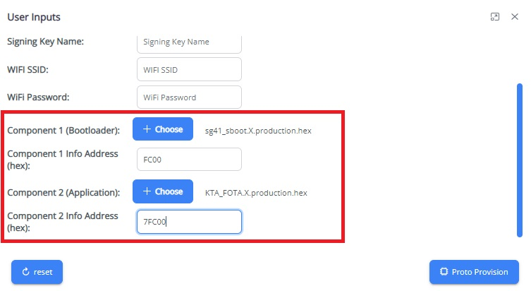

- Click on `Proto Provision` to sign the given components using keySTREAM and save in the Usecase working directory.

- To program the components onto the board:
    - Click Yes in the pop-up to load the keySTREAM signing public key onto the ATECC608-TMNGTLS and program the signed components onto the CryptoAuth Pro Trust Platform boards. This is typically done only for initial components.

    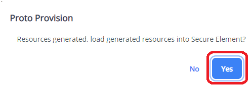

- Once the programming process is complete, please launch the Terminal application (e.g., TeraTerm) on your computer if it has not been set up initially.

    - Connect to the Virtual COM port and configure the serial settings as follows:
        - Baud : 115200
        - Data : 8 Bits
        - Parity : None
        - Stop : 1 Bit
        - Flow Control : None

- Press the Reset button on CryptoAuth Pro Trust Platform Development Kit

- Review the output message in the console:

   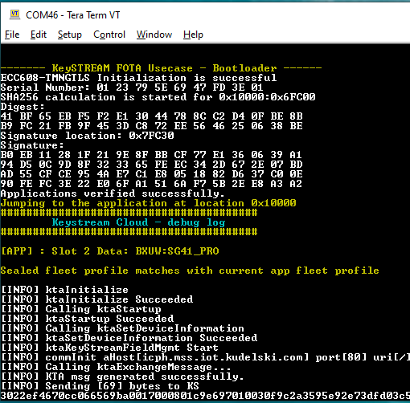

### Preparing new Application Image for FoTA update

 - Navigate back to MPLAB X IDE and in the "KTA_FOTA" Project, expand drop-down for the "app_winc_s02.h" to update APP_VERSION_PATCH as 1

        #define APP_VERSION_MAJOR 1
        #define APP_VERSION_MINOR 1
        #define APP_VERSION_PATCH 1

    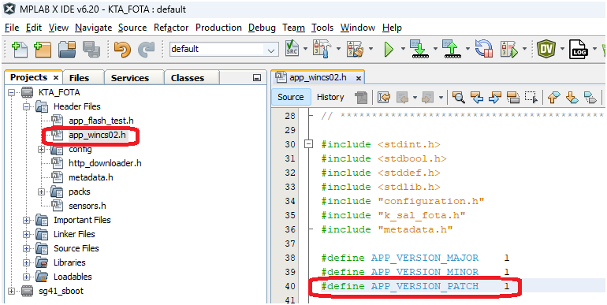

 - Clean and Build KTA_FOTA application with new version... Wait for the build process to complete and generate the binaries.

    

- Click on `Proto Provision` to create signed components from the generated binary

    

- Click on `reset` to clear previous Component selection if exists

    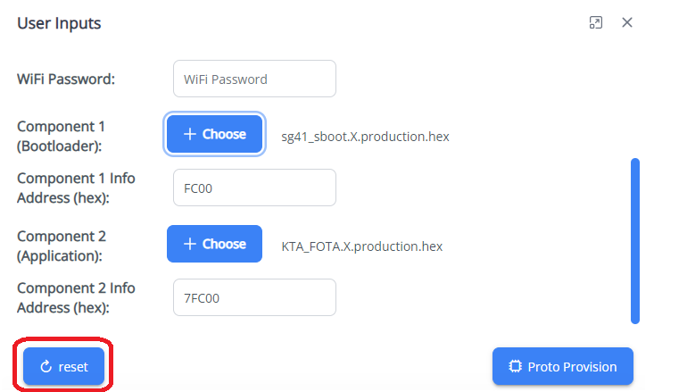

- Leave Fleet Profile Public UID, Authorization Token, Signing Key Name, WiFi SSID, WiFi Password inputs blank to use from the previously generated resources.

- **Component2 (Application):** - Upload the Component2 (KTA_FOTA application) hex file that was built in the previous step. Please note that the binaries are generated only after the project has been built, the default location will be: `~/.trustplatform/keystream_fota/firmware/sg41_kta_fota/KTA_FOTA.X/dist/default/production`.

- **Component2 Info Address (hex):** - Each component should include metadata detailing its version, image address, size, signature locations, and other relevant information. Please specify the location of this metadata. For this use case, the FoTA application metadata  is located at 7FC00.

- Click on `Proto Provision` button, this will generate the signed Component for the new binary with APP_VERSION_PATCH set to 1.

- Click **No** in the pop-up asking to load generated resources into Secure Element.

    

- The signed component_02010101.bin (may vary based on the VERSION values) and hex will be created in the Usecase working directory `~/.trustplatform/keystream_fota`.

### Preparing a FOTA campaign in the KeyStream Cloud

- Go back to the keySTREAM UI under the `FOTA` option in the left navigation menu

    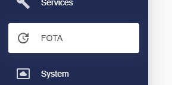

- In the `Fleet Profile` drop-down menu select the fleet you want to push firmware updates into

    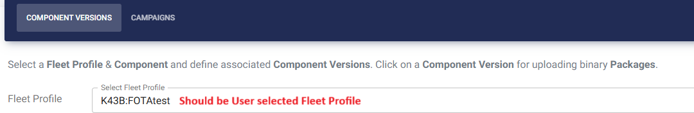

- Click `CREATE COMPONENT` and Name your component as "MCHP-CAL". This is fixed in the Usecase.

    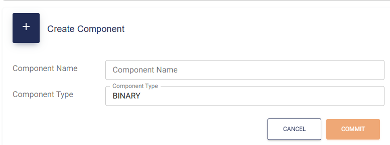

- Now under `Component` drop-down menu you should find the component you just created. Select it

    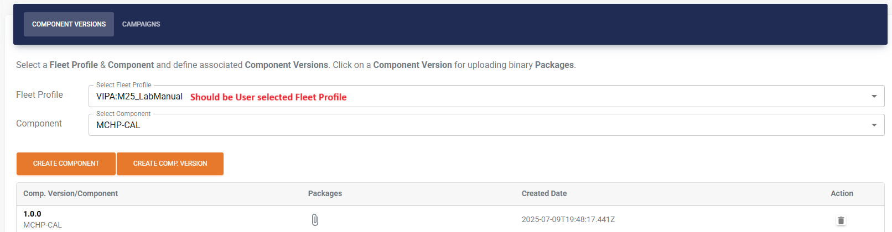

- Press `CREATE COMP. VERSION` and type "1.1.1" and then press "Commit"

    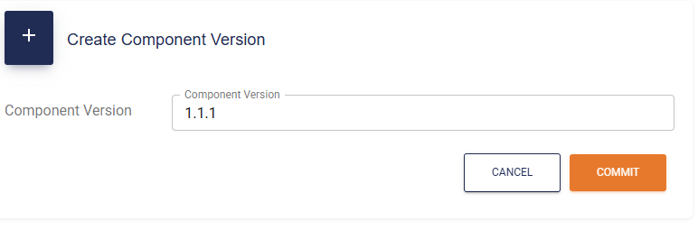

- Select the paper clip under "Packages" column for "1.1.1" to see a window appear to add your package/firmware. Click on "ADD PACKAGE" button

    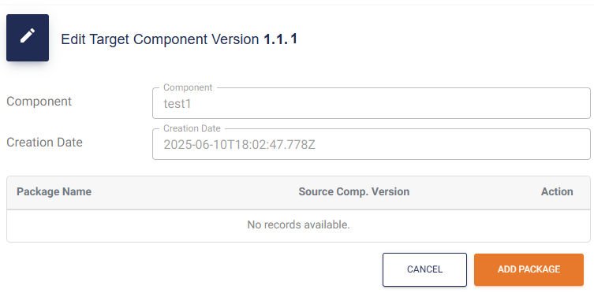

- Upload the updated firmware image, component_02010101.bin. Leave `Source Component Version` field blank, unless you want the firmware update to occur only for specific versions. This field is used to set conditional updates based on existing firmware versions. Once completed, click `COMMIT`.

    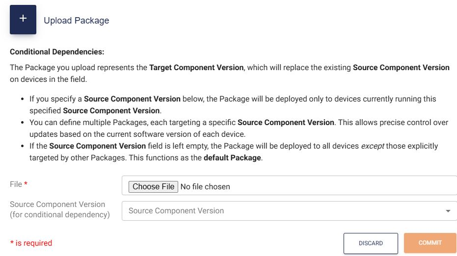

- Switch to the `CAMPAIGNS` tab in the `FOTA` menu at the top of the screen

    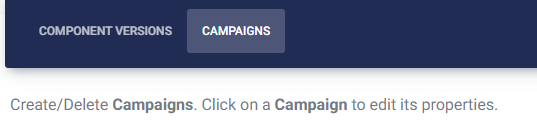

- Create the campaign by clicking `Create Campaign` and click commit once done.

    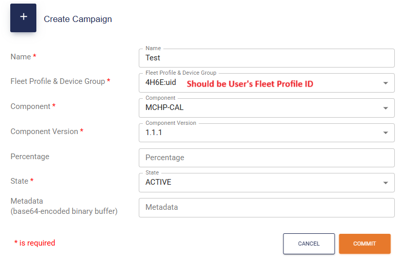

    - The percentage represent the percentage of devices of a given fleet you want to push an update for. It's generally a good practice to update at first a small percentage to ensure there is no incident and grow the percentage as the confidence level rises. For this Usecase, it can be left blank.

- Once you have pressed commit, the firmware over-the-air update is initiated by keySTREAM.

### Observing the result of the FOTA by keySTREAM in TeraTerm

- We will now observe the result of the firmware over-the-air update by keySTREAM in TeraTerm.
- Observe in the bootloader window it will show our MCHP-CAL component and the version we are downloading, 1.1.1:

    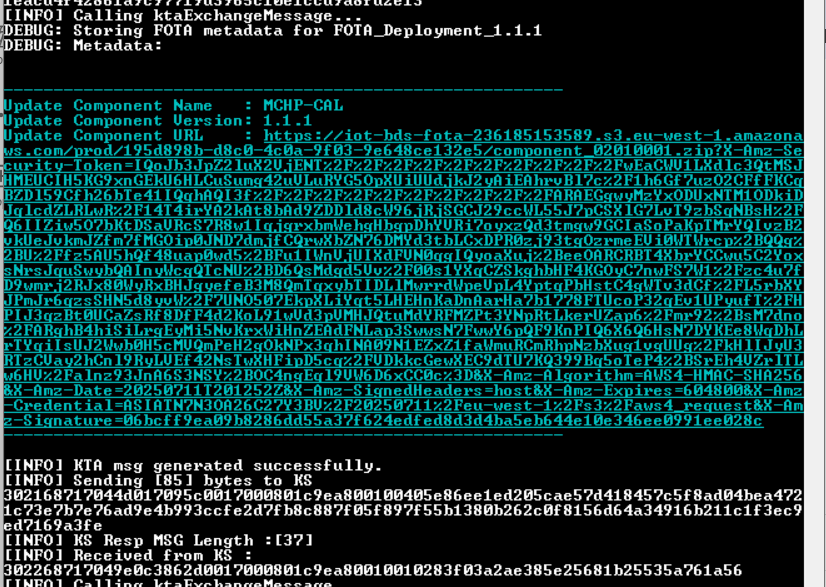

- You will observe it erase other bank on the PIC32SG41 and then it will download this new version to that bank and validate it before executing it.

- On the application TeraTerm output, you will observe it is no longer outputting light sensor readings, but rather the temperature sensor readings.

- You may also verify your FOTA was successfully deployed by navigating to the campaign window in the FOTA tab and then after clicking on your campaign, observing the "updated" field saying "1"

    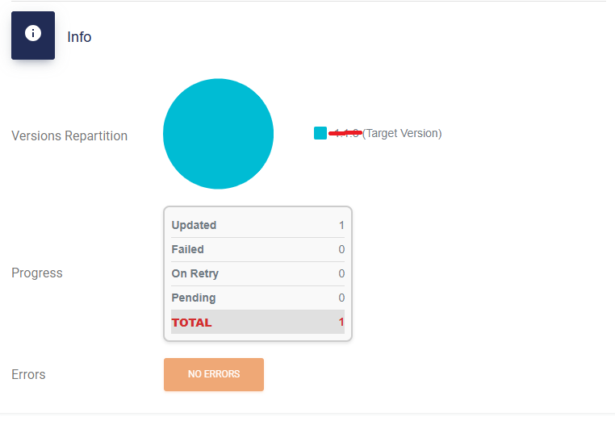

- This completes the FoTA Usecase steps.

## Conclusion

The outlined use case demonstrates the keySTREAM Firmware Over-The-Air Update Usecase with ATECC608-TMNGTLS. This comprehensive guide covers the setup of the CryptoAuth Pro Trust Platform Development Kit, the provisioning of an ATECC608-TMNGTLS device, and the generation of necessary resources. It concludes with the steps to build and program the firmware, ultimately verifying the successful implementation of keySTREAM Firmware Over-The-Air Update through the ATECC608-TMNGTLS secure element.
