# TA010 Symmetric Authentication

This application example demonstrates symmetric authentication using the Microchip TA010-TFLXAUTH device for accessory/disposable authentication with a diversified symmetric key authentication method.

## Description

- The master symmetric key is securely stored in the Host Secure Element, while a derived key (derived from a root symmetric key and the Secure Element serial number) is stored in the Accessory Secure Element.
- Storing the master symmetric key in the ATECC608 ensures that the master key remains protected and is never exposed.
- In this example application, the Host Secure Element is the ATECC608, and the Accessory Secure Element is the TA010.

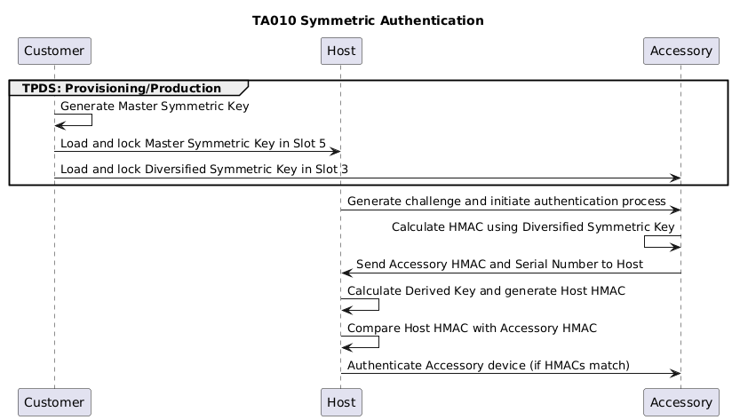

## Training Video

# TA010 Symmetric Authentication

## Prerequisites

- [TPDS(Trust Platform Design Suite)](https://www.microchip.com/en-us/products/security/trust-platform/tpds)
- [MPLAB® X IDE](https://www.microchip.com/en-us/tools-resources/develop/mplab-x-ide#tabs)
- [Cryptoauth Trust Platform Development Kit](https://www.microchip.com/developmenttools/productdetails/DM320118)
- [EV74C12A - TA010 mikroBUS Evaluation Board](https://www.microchip.com/en-us/development-tool/EV74C12A)

## Setting up Cryptoauth Trust Platform Development Kit (DM320118)

- Ensure both the ON switch and CTS switch on the DM320118 Kit is in the ON position. Refer to label 6 in the figure below.

    

- Insert the EV74C12A Socket Board into the mikroBUS header of the Cryptoauth Trust Platform Development Kit.

- Connect the micro USB port on the board to the computer using a micro USB cable. You should notice Power LEDs light up on both the Trust Platform board as well as the TA010 Socket board.

## Setting up for Usecase
- Make sure the MPLABX path is set in File -> Preferences -> MPLABX path.

    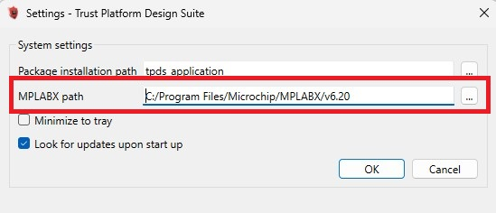

- Make sure the DM320118 board is factory programmed. Navigate to the Utilities Tab, select **DM320118** and press **Factory Program**. This step ensures the MCU is programmed with the default firmware needed to provision the TA010 in the next steps. Without the default firmware, the next steps will not work.

- After factory programming process is complete, launch the Terminal application (e.g., Tera Term) on your computer.

- Connect to the Virtual COM port and configure the serial settings as follows:
    - Baud : 115200
    - Data : 8 Bits
    - Parity : None
    - Stop : 1 Bit
    - Flow Control : None

- Press the Reset button on the Cryptoauth Trust Platform Development Kit and observe the following log:

    

## Opening the TA010 Symmetric Authentication Usecase

- Open TPDS and navigate to Usecases Section.
- Select Usecase as `Symmetric Authentication - Diversified Key` under TA010-TFLXAUTH and the kit as `CryptoAuth Trust Platform`

    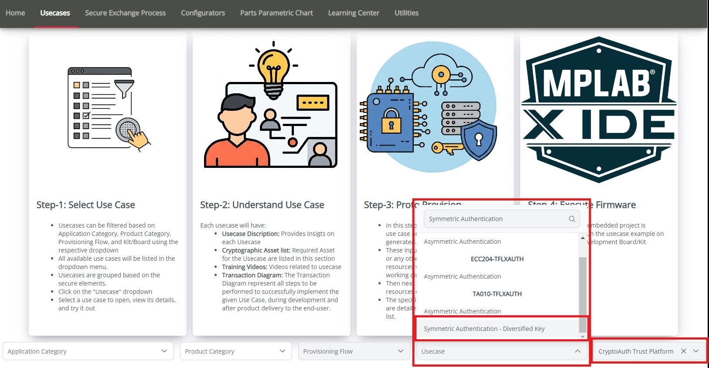

- The `TA010-TFLXAUTH - Symmetric Authentication` usecase will open as below:

    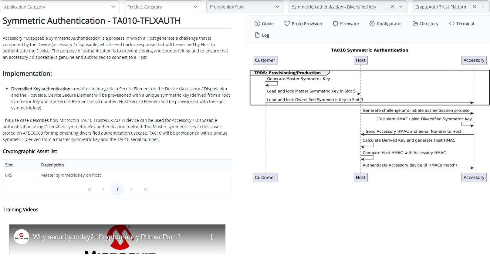

## Provisioning Blank TA010 Device
To configure a blank TA010 device into TA010-TFLXAUTH device for the usecases, follow these steps:

### Open TA010-TFLXAUTH Configurator

Click on the "Configurator" button within the use case to launch the TA010-TFLXAUTH Configurator.

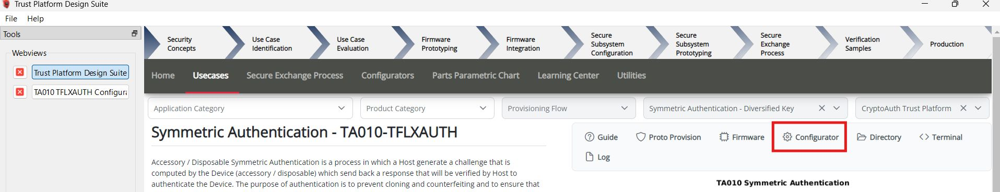

##### Adjust the Configuration

Once the TA010-TFLXAUTH Configurator is open:

- Leave the Device address empty to configure with the default TFLXAUTH address. **The use case requires the device to be configured with the default TFLXAUTH address.**
- Select the I2C or SWI interface in the configurator based on the interface of the device.
- Select Limited key use.

    

##### Proto Provisioning

- After adjusting configuration, scroll down and click on **Provision Prototype Samples**.

    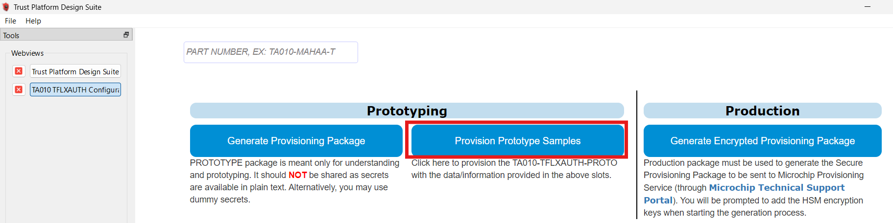

- Wait for the provisioning process to complete. The following result is observe:

    

- Click on **OK** to close the success dialog.

- After provisioning, power cycle the device by disconnecting and reconnecting the USB cable.

## Provisioning Usecase Resources

This step provisions the device for the specified use case. It gathers the necessary resources, generates the firmware resources, and provisions the device accordingly.

- Double-check that you selected the right target development kit.

    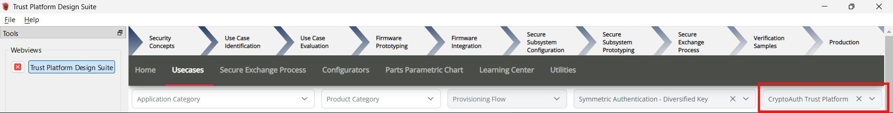

- Click on Proto Provision

    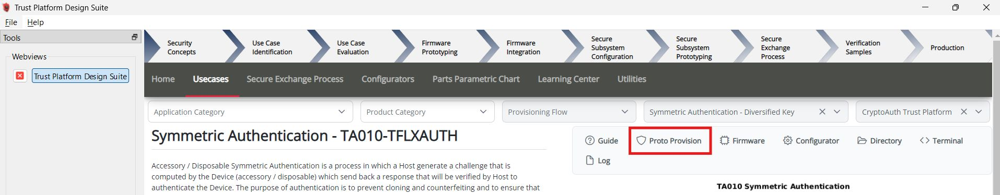

- Select the User Options:
    - Choose the Device Interface, the same interface selected in the configurator.
    - By default, the option to generate a new master symmetric key will be checked. If you prefer to use a user-specific symmetric key, use the upload option.
    - Click on Proto Provision

        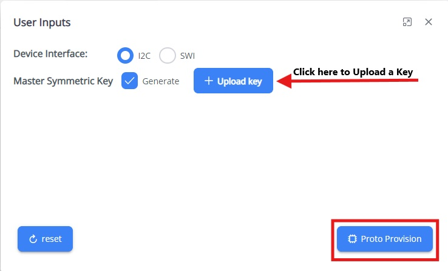

- The necessary resources will be created in the usecase working directory `~/.trustplatform/symm_auth_ta010`:
    - **project_config.h** : Includes the selected interface for communication with the TA010 device.
    - **master_symm_key.pem** : Contains the generated/uploaded master symmetric key in PEM format.

- Click on the `Directory` button to open the use case working directory containing the use case resources.

    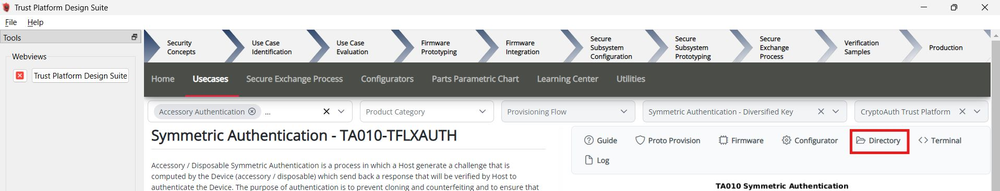

- Click Yes in the pop-up to load resources into the ATECC608 and TA010. A confirmation pop-up will appear once the loading process is complete.

## Build and Program Application
-  Make sure the MPLABX path is set in File -> Preferences -> MPLABX path.

    

- Once the resources have been successfully loaded, open the Firmware Project by clicking on the Firmware button.

    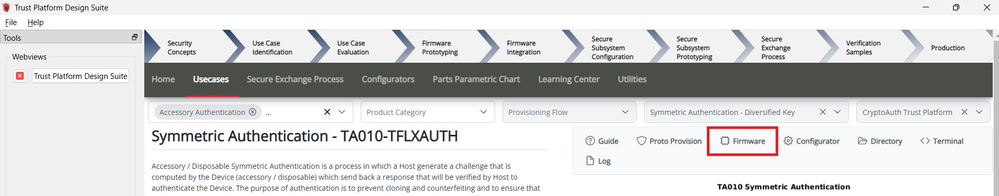

- The project **symm_auth_ta010** will open in the MPLABX IDE.
- Right-click on **symm_auth_ta010** and select "Set as Main Project".

    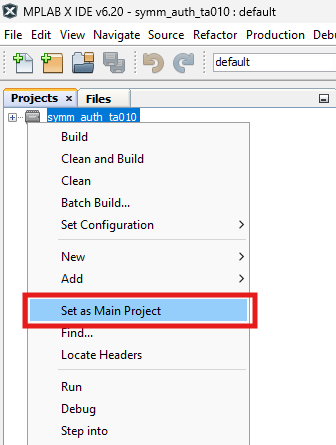

- Click on "Make and Program Device".

    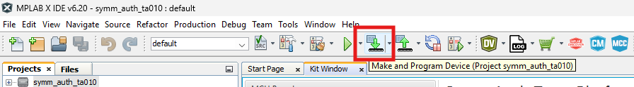

- Once the programming process is complete, please launch the Terminal application (e.g., Tera Term) on your computer if it has not been set up initially.

    - Connect to the Virtual COM port and configure the serial settings as follows:
        - Baud : 115200
        - Data : 8 Bits
        - Parity : None
        - Stop : 1 Bit
        - Flow Control : None

- Press the Reset button on Cryptoauth Trust Platform Development Kit

- The console will display a message indicating that the symmetric authentication was successful.

- Review the output message in the console:

   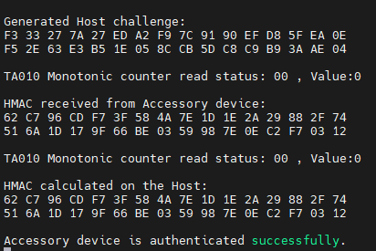

## Conclusion
The outlined usecase demonstrates the configuration of the TA010 as a client accessory, with an ATECC608 as a host, to securely implement a Derived Symmetric Key system.
This concludes the overview, transaction diagram, proto provisioning, and firmware steps associated with Symmetric Authentication using the TA010 secure element.