# TA010 WPC Authentication

The purpose of this Use Case is to authentify a Qi 1.3 Wireless Power Charger from a mobile phone, as Qi 1.3 specification mandate the usage of a Secure subsystem (Secure Element) on the charger side. It is based on a standard asymmetric authentication

Asymmetric Authentication is a process based on a custom PKI (Public Key Infrastructure) where a Host (mobile phone) will authenticate that the WPC charger (device) is genuine. The Host will first verify the Signer certificate (Manufacturer) device certificates (Product Unit Certificate PUC) based on the Root CA Public key and will generate a challenge to be signed by the charger private key. The Host will then perform an ECDSA verify command to ensure that the signed challenge is valid.

This use case describes how Microchip TA010-TFLXWPC Secure Subsystem can be used for Qi 1.3 WPC authentication using asymmetric authentication (Custom PKI based).

## Description

- Implements a comprehensive asymmetric (public/private) key cryptographic signature solution based on Elliptic Curve Cryptography (ECC) and the ECDSA signature protocol.
- **Verify Certificate Chain:**
    - The Host requests the Manufacturer Certificate and verifies the certificate with the Authority Public key(Root).
    - Upon successful verification, the Host requests the Product Unit Certificate and verifies it using the Manufacturer Certificate.
    - The Host requests WPC Chain Digest and verifies the WPC Chain Digest.
- **Challenge-Response:**
    - The Host generates a random number challenge and sends it to the TA010-TFLXWPC.
    - The TA010-TFLXWPC signs the random number challenge with the Device Private Key.
    - The signed challenge is returned to the Host for verification using the Device Public Key, thereby completing the Chain of Trust verification.
    - In this usecase, ATECC608 is used for Certificate chain verification and signature verification on Host side. 

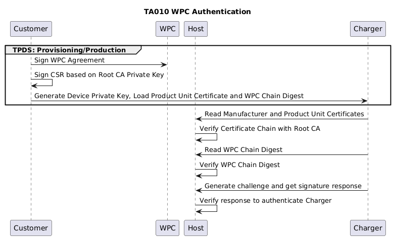

## Training Video

# TA010 WPC Authentication

## Prerequisites

- [TPDS(Trust Platform Design Suite)](https://www.microchip.com/en-us/products/security/trust-platform/tpds)
- [MPLAB® X IDE](https://www.microchip.com/en-us/tools-resources/develop/mplab-x-ide#tabs)
- [Cryptoauth Trust Platform Development Kit](https://www.microchip.com/developmenttools/productdetails/DM320118)
- [EV74C12A - TA010 mikroBUS Evaluation Board](https://www.microchip.com/en-us/development-tool/EV74C12A)

## Setting up Cryptoauth Trust Platform Development Kit (DM320118)

- Ensure both the ON switch and CTS switch on the DM320118 Kit is in the ON position. Refer to label 6 in the figure below.

    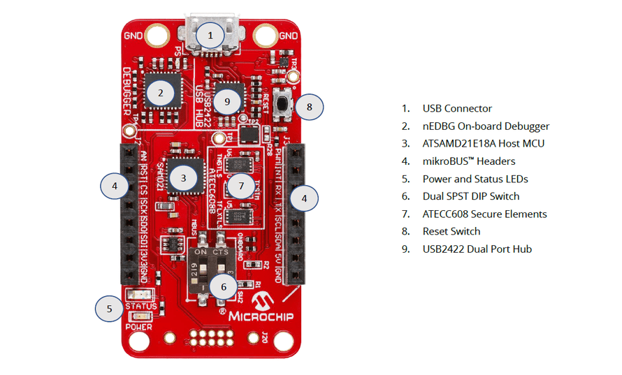

- Insert the EV74C12A Socket Board into the mikroBUS header of the Cryptoauth Trust Platform Development Kit.

- Connect the micro USB port on the board to the computer using a micro USB cable. You should notice Power LEDs light up on both the Trust Platform board as well as the EV74C12A Socket board.

## Setting up for Usecase
- Make sure the MPLABX path is set in File -> Preferences -> MPLABX path.

    

- Make sure the DM320118 board is factory programmed. Navigate to the Utilities Tab, select **DM320118** and press **Factory Program**. This step ensures the MCU is programmed with the default firmware needed to provision the TA010 in the next steps. Without the default firmware, the next steps will not work.

- After factory programming process is complete, launch the Terminal application (e.g., Tera Term) on your computer.

- Connect to the Virtual COM port and configure the serial settings as follows:
    - Baud : 115200
    - Data : 8 Bits
    - Parity : None
    - Stop : 1 Bit
    - Flow Control : None

- Press the Reset button on the Cryptoauth Trust Platform Development Kit and observe a similar log:

    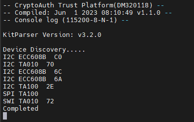

## Opening the TA010 WPC Authentication Usecase

- Open TPDS and navigate to Usecases Section.
- Select the kit as `CryptoAuth Trust Platform`.
- Select Application Category as `WPC`.

    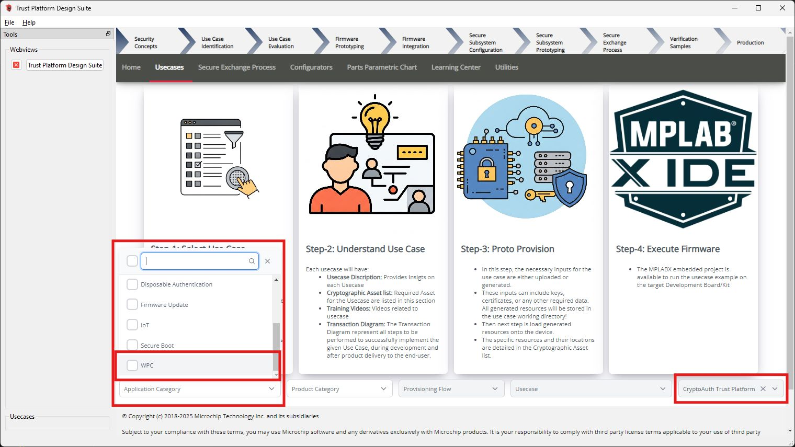

- Select Usecase as `WPC Authentication` under TA010-TFLXWPC.
 
    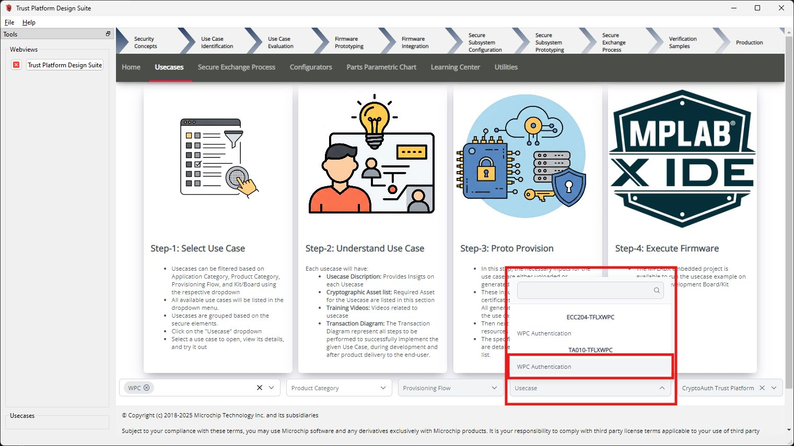

- The `TA010-TFLXWPC - WPC Authentication` usecase will open as below:

    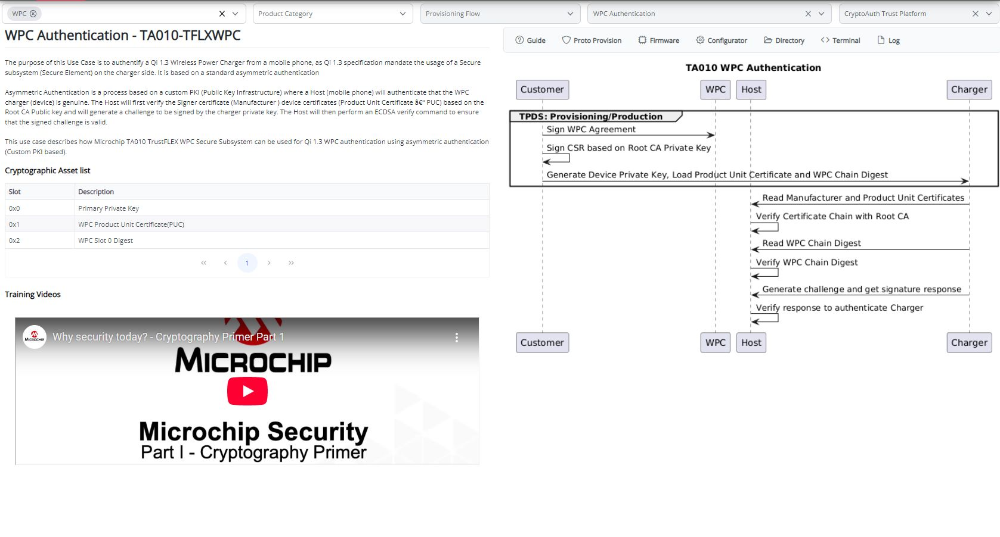

## Provisioning Blank TA010 Device
To configure a blank TA010 device into TA010-TFLXWPC device for the usecases, follow these steps:

### Open TA010-TFLXWPC Configurator

Click on the "Configurator" button within the use case to launch the TA010-TFLXWPC Configurator.

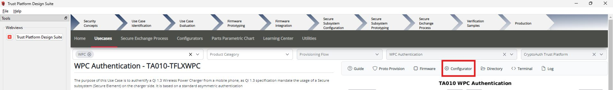

##### Adjust the Configuration

Once the TA010-TFLXWPC Configurator is open:

- Leave the Device address empty to configure with the default TFLXWPC address. **The use case requires the device to be configured with the default TFLXWPC address.**

##### Proto Provisioning

- After adjusting configuration, scroll down and click on **Provision Prototype Samples**.

    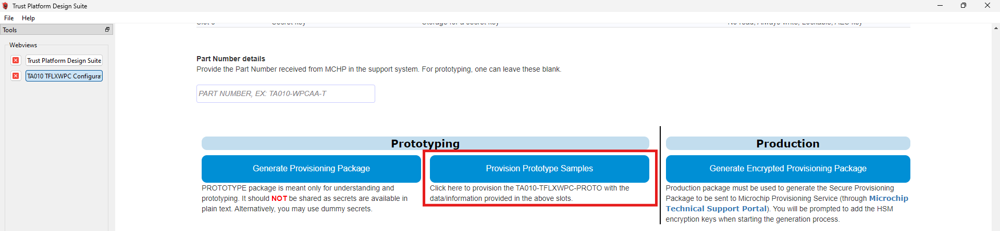

- Wait for the provisioning process to complete. The following result is observe:

    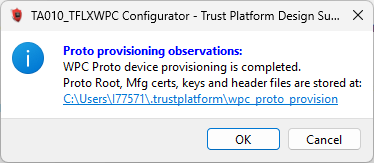

- Click on **OK** to close the success dialog.

- After provisioning, power cycle the device by disconnecting and reconnecting the USB cable.

## Provisioning Usecase Resources

This step provisions the device for the specified use case. It gathers the necessary resources, generates the firmware resources, and provisions the device accordingly.

- Double-check that you selected the right target development kit.

    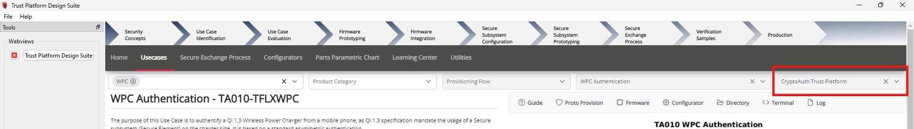

- Click on Proto Provision

    

- Provide the User Inputs:
    - Enter `PTMC Code`, `Qi ID` and `CA Sequence ID` in respective input fields. For prototyping, these fields can be left blank, and default values will be used.
    - Choose the Generate option to create new private keys or upload user-specific keys for the Root and Manufacturer private keys.
    - Click on Proto Provision 

        

- The necessary resources will be created in the usecase working directory `~/.trustplatform/wpc_auth_ta010`:
    - **ta010_tflxwpc.h**: This file contains generated Root, Manufacturer certificates and other data in c, which is useful for firmware project.
    - **wpc_root_cert.crt**: This file contains generated Root Certificate.
    - **wpc_mfg_{PTMC CODE}-{CA Sequence ID}.crt**: This file contains generated Manufacturer Certificate.
    - **wpc_puc_ta010_{SN}.crt**: This file contains generated PUC Certificate.
    - **wpc_root_key.pem**: This file contains generated/uploaded Root Private Key.
    - **wpc_mfg_{PTMC CODE}-{CA Sequence ID}_key.pem**: This file contains generated/uploaded Manufacturer Private Key.
    - **device_pub_key_{SN}.pem**: This file contains Product Unit Public Key Read from device.

- To open the use case working directory containing the use case resources Click on the `Directory` button .

    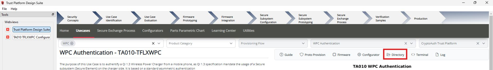

- Click Yes in the pop-up to load resources into TA010. A confirmation pop-up will appear once the loading process is complete.

## Build and Program Application
-  Make sure the MPLABX path is set in File -> Preferences -> MPLABX path.

    

- Once the resources have been successfully loaded, open the Firmware Project by clicking on the Firmware button.

    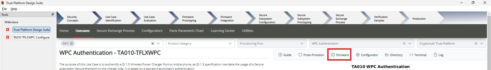

- The project **wpc_auth_ta010** will open in the MPLABX IDE.
- Right-click on **wpc_auth_ta010** and select "Set as Main Project".

    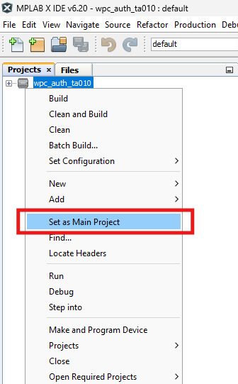

- Click on "Make and Program Device".

    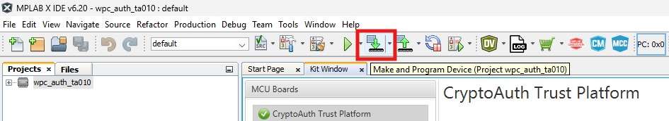

- Once the programming process is complete, please launch the Terminal application (e.g., Tera Term) on your computer if it has not been set up initially.

    - Connect to the Virtual COM port and configure the serial settings as follows:
        - Baud : 115200
        - Data : 8 Bits
        - Parity : None
        - Stop : 1 Bit
        - Flow Control : None

- Press the Reset button on Cryptoauth Trust Platform Development Kit

- The console will display a message indicating that the WPC authentication was successful.

- Review the output message in the console:

   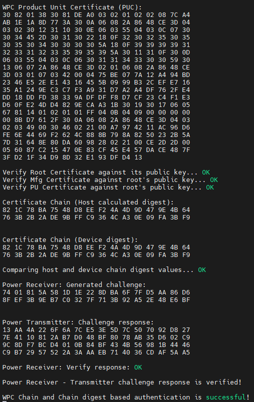

## Conclusion

The outlined use case demonstrates the configuration of the TA010-TFLXWPC device for WPC authentication, utilizing ECC and ECDSA algorithms to ensure Secure subsystem (Secure Element) on the charger side. This comprehensive guide covers the setup of the Cryptoauth Trust Platform Development Kit, the provisioning of a blank TA010 device, and the generation of necessary cryptographic resources. It concludes with the steps to build and program the firmware, ultimately verifying the successful implementation of WPC authentication through the TA010-TFLXWPC secure element.